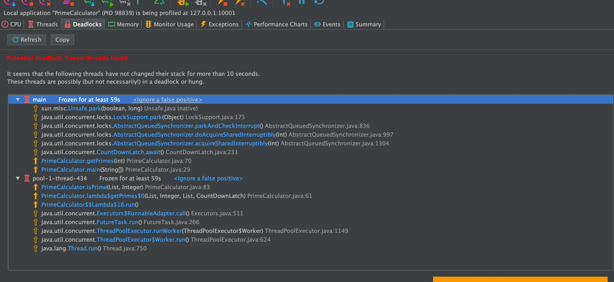
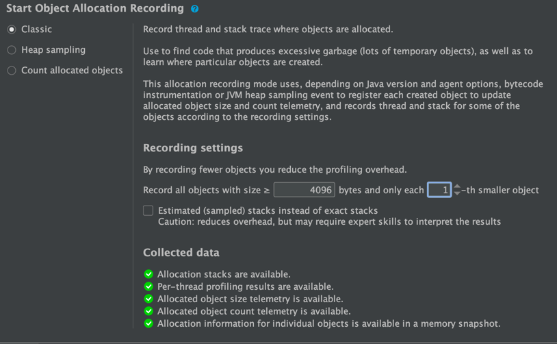

# Contents
1. [Overview](#1-overview)<br/>
&nbsp;&nbsp;1.1 [Prerequisites](#11-prerequisites)<br/>
   &nbsp;&nbsp;1.2 [How to run test](#12-how-to-run-test)<br/>
2. [CPU and Memory analysis](#2-cpu-and-memory-analysis)<br/>
   &nbsp;&nbsp;2.1 [ Execution environment](#21-execution-environment)<br/>
   &nbsp;&nbsp;2.2 [CPU analysis - 500,000 numbers, 1500 threads](#22-cpu-analysis---500000-numbers-1500-threads)<br/>
   &nbsp;&nbsp;2.3 [CPU analysis - 50,000 numbers, 50,000 threads](#23-cpu-analysis---50000-numbers-50000-threads)<br/>
   &nbsp;&nbsp;2.4 [Heap analysis - 50,000 numbers, 50,000 threads](#24-heap-analysis---50000-numbers-50000-threads)<br/>
   &nbsp;&nbsp;2.5 [Lock analysis](#25-lock-analysis)<br/>
3. [Automation - benchmark for performance comparison](#3-automation---benchmark-for-performance-comparison)<br/>
   3.1 [Java Microbenchmark Harness (JMH)](#31-java-microbenchmark-harness-jmh)<br/>
   3.2 [JMH configuration](#32-jmh-configuration)<br/>
   3.2.1 [JMH Benchmark mode](#321-jmh-benchmark-mode)<br/>
   3.2.2 [Warmup iterations](#322-warmup-iterations)<br/>
   3.2.3 [Avoiding dead code elimination by JVM](#323-avoiding-dead-code-elimination-by-jvm)<br/>
   3.2.4 [SetUp / TearDown](#324-setup--teardown)<br/>
4. [Code enhancements](#4-code-enhancements)<br/>
4.1 ["isPrime(...)" method](#41-isprime-method)<br/>
4.2 [Concurrency level and execution](#42-concurrency-level-and-execution)<br/>
4.3 [Redundant use of BigIntegerIterator](#43-redundant-use-of-bigintegeriterator)<br/>
5. [Existing algorithms](#5-existing-algorithms)<br/>
6. [Experiments](#6-experiments)<br/>
6.1 [Test configuration](#61-test-configuration)<br/>
   6.2 [Baseline - benchmark of original implementation](#62-baseline---benchmark-of-original-implementation)<br/>
   6.3 [Elimination of excessive objects](#63-elimination-of-excessive-objects)<br/>
   6.4 [Change of concurrency level and management](#64-change-of-concurrency-level-and-management)<br/>
7. [Results](#7-results)<br/>
7.1 [Visualization](#71-visualization)<br/>
7.2 [Comparison of implemented algorithms](#72-comparison-of-implemented-algorithms)<br/>

8. [Observed issues](#8-observed-issues)<br/>
   8.1 [MacBook Air M1 - thread limitations](#81-macbook-air-m1---thread-limitations)<br/>
   8.2 [YourKit - allocation profiling issue](#82-yourkit---allocation-profiling-issue)<br/>
9. [Troubleshooting](#9-troubleshooting)<br/>
   9.1 [Missing /META-INF/BenchmarkLis @ JMH start up](#91-missing-meta-infbenchmarklist--jmh-start-up)<br/>


# 1. Overview
Qualification, characterization and improvement the performance of prime number's calculator.

CPU, RAM and Lock analysis have been done via [YourKit](https://www.yourkit.com) Java profiler, the comparison between different
implementation have been done via [Java Microbenchmark Harness (JMH)](https://github.com/openjdk/jmh). In order to simplify comparison between the builds, automation for [visualization of JMH results](#71-visualization) have been implemented.


The repository contains original code sample, YourKit's CPU and Allocation profiling data, its analysis and code enhancements.

In order to view the final results, please, see [7.2  Comparison of implemented algorithms](#72-comparison-of-implemented-algorithms)

## 1.1 Prerequisites

- `JRE 8`. Please, note that JRE is required to use the solution itself, yet, performance test automation (Java Microbenchmark Harness) requires `JDK`.
- `(optional) YourKit Java Profiler` - visualization of CPU / allocation samples.
- `(optional) Python 3` - visualization of results.

# 1.2 How to run performance test
In order to build the solution and execute performance test, please, run the following command:
```
./gradlew clean build jmh
```
The results would be available in CSV format at `build/reports/benchmarks.csv'`. In order to change the format or file location,
please, modify `jmh {...}` section of [build.gradle](build.gradle):
```
jmh {
    ...
    resultFormat = 'csv'
    resultsFile = file('build/reports/benchmarks.csv')
}
```

# 2. CPU and Memory analysis.

## 2.1 Execution environment

Each test had been executed locally on laptops that were available to me. 

* Max Prime number: 50,000 - 500,0000. Such decision had been made in order to get sufficient amount of CPU samples during profiling. 
* JVM Options. `-Xms4096m -Xmx4096m -Xss1024k`

That had led to the need to make code changes for testing purposes:
`MacBook Air (M1, 2020)` - JVM supports only 4,000 threads. Therefore, thread pool's capacity had been modified in some experiments 
(see: [2.2 CPU analysis - 500,000 numbers, 1500 threads](#22-cpu-analysis---500000-numbers-1500-threads) and
[8.1  MacBook Air M1 - thread limitations](#81-macbook-air-m1---thread-limitations))


## 2.2 CPU analysis - 500,000 numbers, 1500 threads

Prior to execution of the experiment, thread pool's capacity had been reduced. In original implementation, that was either 3000 or `maxPrime`, depends on 
which one was higher. Such configuration had led to Java OOM within my Macbook Pro M1. 

After multiple failed attempts to eliminate it (see: [8.1 MacBook Air M1 - thread limitations](#81-macbook-air-m1---thread-limitations)), 
it was considered to reduce amount of threads within the pool down to 1500,
otherwise the amount of samples would be relatively small, which would make it harder to analyze the results of CPU and Heap profiling.
```
public static List<Integer> getPrimes(int maxPrime) throws InterruptedException {
    // ExecutorService executors = Executors.newFixedThreadPool(Math.max(maxPrime / 100, 3000));
    ExecutorService executors = Executors.newFixedThreadPool(1500);
    ...
}
```
Afterwards, the application had been profiled using Yourkit.


A more simple view would be in the form of flamegraph:


Looking at ([500k-primes-1500-threads-PrimeCalculator-2022-07-28.snapshot](snapshots/cpu/500k-primes-1500-threads-PrimeCalculator-2022-07-28.snapshot)),
the following observations had been made:
* **Issue 1.** The samples link to the removal of non-prime numbers - ` primeNumbers.remove(toRemove)`. 
Given the fact `primeNumbers` is an instance of `LinkedList`, each removal operation requires traversing the list to look up 
the element and remove it - it's an O(N) operation.
Omitting changes within business logic itself (to not use a collection for storage of non-prime numbers), a more suitable 
collection for this use case would be `HashSet`, as it removes element by O(1) time.
* **Issue 2 & 3**. Both of them are related to insufficient control of application workflow - via `Exception` instances. 
Depending on stack trace, stack depth and type, the creation of `Exception` instance is expensive. 
Considering their frequent creation in our case, the affection on performance (CPU, Heap and, as a result, GC) is inevitable.
A more simple and less expensive approach would be the use of `boolean` type.

Snapshot: [500k-primes-1500-threads-PrimeCalculator-2022-07-28.snapshot](snapshots/cpu/500k-primes-1500-threads-PrimeCalculator-2022-07-28.snapshot)

## 2.3 CPU analysis - 50,000 numbers, 50,000 threads

Unlike [2.2 CPU analysis - 500,000 numbers, 1500 threads](#22-cpu-analysis---500000-numbers-1500-threads), the experiment
had been conducted on Windows laptop, which I was able to use for a day. Within that environment, JVM was capable of having 
~50,000 threads - such value would be enough for efficient profiling of the application.

Thus, the logic from original implementation had been used - thread pool's capacity is either 3000 or `maxPrime`, depends on
what is higher.
```
public static List<Integer> getPrimes(int maxPrime) throws InterruptedException {
    ExecutorService executors = Executors.newFixedThreadPool(Math.max(maxPrime / 100, 3000));
    ...
}
```


Looking at [50k-primes-cpu-PrimeCalculator.snapshot](snapshots/cpu/50k-primes-cpu-PrimeCalculator.snapshot), the following observations could be made:
* Most (92%) of the operations within CPU samples are dedicated to thread's initialization, while only 7% is dedicated to 
actual business logic - determination of prime numbers.
* 77% of such operations is related to the creation of the thread.

Therefore, the following changes could be suggested:
1. **Reduce concurrency level**. Each thread requires stack. Such immense amount of threads - 3000 at minimum - introduces 
significant context switching time, as well as requires memory allocation.
2. **Use different thread pool implementation**. Thread pool used within the original implementation - `newFixedThreadPool(...)` - creates a certain
amount of worker threads (equal to max prime number) and a queue of the task (check if a number is prime). All the tasks are
put onto blocking queue (see: implementation of `newFixedThreadPool(...)` below), thus, given our concurrency level, a significant
contention within the queue is unavoidable.

```
...
 public static ExecutorService newFixedThreadPool(int nThreads) {
        return new ThreadPoolExecutor(nThreads, nThreads,
                                      0L, TimeUnit.MILLISECONDS,
                                      new LinkedBlockingQueue<Runnable>());
    }
 ...
```


## 2.4 Heap analysis - 50,000 numbers, 50,000 threads


Looking at [snapshots/allocation/60k-allocation-profiling-original.csv](snapshots/allocation/60k-allocation-profiling-original.csv), the following 
observations could be made:
1. **Redundant use of `BigIntegerIterator`**. We generate [2; maxPrime] instances of `BigIntegerIterator` and append it onto Collection.
The following aspects could be retrieved from the issue: (a) `BigIntegerIterator` contains two collection with excessive initial capacity - 500 elements, while
we append at-most 1 element to it; (b) we don't need two separate collections to store Integer values (`reference`) and its string
representatives (`contain`); (c) `BigIntegerIterator` class is redundant - it could be replaced by operations with the collection itself.
```
class BigIntegerIterator {
    private final List<String> contain = new ArrayList<>(500);
    private final List<Integer> reference = new ArrayList<>(500);
    ...
}
...
List<BigIntegerIterator> myFiller = Stream.generate(new Supplier<BigIntegerIterator>() {
            ...
            @Override
            public BigIntegerIterator get() {
                return new BigIntegerIterator(i++);
            }
        }).limit(maxPrime).collect(Collectors.toList());
```
2. **Creation of Runnable tasks**. Given the nature of the application - concurrent determination of prime numbers - the creation
of such objects is reasonable. Yet, as stated within CPU profiling 
([2.3  CPU analysis - 50,000 numbers, 50,000 threads](#23-cpu-analysis---50000-numbers-50000-threads), concurrency level and thread pool implementation
could be changed.
3. Conversion of `String` to `Integer`. As stated in (1), there's no need to store integer value and its string representative separately.
Thus, this part of the code could be eliminated.
4. Creation of Lambda for executor service task. As stated in (2), given the concurrency nature of the application, it's reasonable to 
have such objects within heap.
5. **Creation of sublist and iteration over it.** The logic for prime numbers determination creates sublist of dividers for prime 
number candidates. Given the fact we know the bounds of the range for potential candidates, there's no need to 
generate a separate collection for it at each call of `isPrime(...)`.
```
private static void isPrime(List<Integer> primeNumbers, Integer candidate) throws Exception {
        for (Integer j : primeNumbers.subList(0, candidate - 2)) {
            if (candidate % j == 0) {
                throw new Exception();
            }
        }
...
}
```
6. **Creation of `Exception` in order to create application workflow**. As stated in "CPU" section, that could be eliminated.
As stated within [2.2 CPU analysis - 500,000 numbers, 1500 threads](#22-cpu-analysis---500000-numbers-1500-threads),
   the use of Exceptions is redundant, especially considering performance affection it causes via additional CPU and Heap pressure.
   Generation of `Exceptions` instances could be replaced with returning a primitive `boolean` value from `isPrime(...)`.

7. **Excessive concurrency level**. Original implementation assumes at least 3000 threads within the pool would be created.
Depends on the environment, it might lead to excessive use of RAM (thread stacks) and native OS threads. As a result, in multiple environments,
such approach would lead to Java `OutOfMemoryError` due to inability to create a new thread.
```
ExecutorService executors = Executors.newFixedThreadPool(Math.max(maxPrime / 100, 3000));
...
java.lang.OutOfMemoryError: unable to create new native thread
```

Excessive allocation of objects could be found in:


* **Creation of excessive threads**. each thread occupies stack, but we could reduce concurrency. Leads to OOM.


## 2.5 Lock analysis
During CPU profiling, YourKit reported potential deadlock.


In my assumption, it's not a logical deadlock, but rather the indicator that multiple threads are waiting for the acquisition of 
resources for more than 10 seconds. Such behavior is caused by the combination of the following factors:
1. `Executors.newFixedThreadPool(...)`  uses `LinkedBlockingQueue` for executable tasks.
2. `primeNumbers` are stored within synchronized LinkedList.
3. `primeNumbersToRemove` are stored in synchronized LinkedList and accessed within `synchronized` block.

```
...
    List<Integer> primeNumbers = Collections.synchronizedList(new LinkedList<>());
    List<Integer> primeNumbersToRemove = Collections.synchronizedList(new LinkedList<>());
    synchronized (primeNumbersToRemove) {
    ...
    }
...
```

The following points for improvements could be made:
1. `primeNumbers` is always accessed by a single thread, thus it might be a regular collection.
2. `primeNumbersToRemove` is a `synchronizedList`, yet it's being modified within `synchronized(primeNumbersToRemove)` block, 
making the application logically single-threaded in this area. We would've needed `synchronized` if we'd have been iterating over 
`primeNumbersToRemove`, but we iterate over `primeNumbers` instead and perform only `add(...)` method, which uses mutex internally.
```
static class SynchronizedList<E> ... {
   public void add(int index, E element) {
      synchronized (mutex) {list.add(index, element);}
   }
...
}
```

## 2.6  Analysis - conclusion
Based on CPU, RAM and Lock analysis, we could make enhancements to the application: data structures, concurrency, application workflow.

In order to sufficiently compare the performance, that'd be useful to understand how user would see it.

# 3. Automation - benchmark for performance comparison

Profiling of the application provides significant benefits while investigating its behavior: resource consumption (CPU / RAM / Heap / off-heap),
object allocation, state of threads. Using the objectives made based on such analysis, developers could enhance application performance and stability.

While being useful for the analysis, it might be hard to use profiling data to compare the performance of 2 (or more) versions of the application, since
the majority of profilers use CPU sampling instead of wall-clock time. Instead, in order to determine performance of the application
in different use-cases, we could use `benchmarking` - a programmatic way to configure, execute and measure useful work of business logic 
from user perspective.

As an outcome from benchmarking, we'd retrieve numerical characteristics, which we could use to qualify and characterize the performance of different 
versions of the app.

## 3.1 Java Microbenchmark Harness (JMH)

[Java Microbenchmark Harness (JMH)](https://github.com/openjdk/jmh) is a Java harness for building, running, and analysing
nano/micro/milli/macro benchmarks written in Java and other languages targeting the JVM.

Within the implementation, we'd use the following JMH-related dependencies:
1. `jmh-core` - business logic of microbenchmark harness.
2. `jmh-generator-annprocess` - annotation processor for simplified configuration and usage of JMH API.

## 3.2 JMH configuration
The section describes core configuration options for the tool used within automation for performance tests - 
[JMH](https://github.com/openjdk/jmh).

### 3.2.1 JMH Benchmark mode
JMH has the following modes of execution ([java doc](http://javadox.com/org.openjdk.jmh/jmh-core/0.8/org/openjdk/jmh/annotations/Mode.html)):

* **`Throughput`** - measures the number of operations per second - number of times per second the method could be executed. 
Given the nature of the application (concurrent detection of prime numbers), that'd be better to focus on duration rather than throughput.
* **`Average time`** - measures average time for a single execution. "Average" wouldn't be an efficient metric due to GC pauses. 
It might be convenient for us to get a complete distribution of measurements (1st - 100th percentiles).
* **`Sample time`** - measures how long time it takes for the benchmark method to execute, including max, min time etc. 
Such distribution of the values should be convenient for our case.
* **`Single shot time`** - measures how long time a single benchmark method execution takes to run, which doesn't include JVM warm up.
Given the nature of our application, a single method execution should be sufficient measurement.
* **`All`** - runs all benchmark modes. This is mostly useful for internal JMH testing due to significant overhead.

Given all the above, `Sample time` mode would provide duration metrics, which we'd be able to use for the comparison of different `PrimeCalculator` versions.
The distribution of such values (1st - 100th percentile) would allow us to have a precise comparison and omit the internment pauses during runtime.

### 3.2.2 Warmup iterations
Given the fact `PrimeCalclator` is Java application, the first invocation of application would be slower than the following ones. 
During the initial execution, additional time would be taken to lazy class loading and JIT.

By having some amount of iterations that wouldn't be included into the measurement - "`warmup`", all classes would be 
cached beforehand, thus they'd be instantly accessed at runtime during the primary phase of benchmark.

### 3.2.3 Avoiding dead code elimination by JVM

While conducting performance experiments, that'd be useful to simulate the workload that's close to real-world scenario.

In case the result of benchmarking method - `getPrimes(...)` - wouldn't be used anywhere, JVM would detect that and apply 
a related optimizations, which would misleadingly affect performance measurements.

In order to exclude such situations, JMH provides `Blackhole` object, which could be used as a consumer of the output of benchmarking method.
That'd prevent an unwanted dead code elimination by JVM.

### 3.2.4 SetUp / TearDown
Given the nature of the original method and the fact it generates sequence of the numbers on demand, no set up or tear down actions are needed.

# 4. Code enhancements
The section lists enhancements that had been made to the original implementation of prime numbers' calculator.

## 4.1 "isPrime(...)" method
```
    private static void isPrime(List<Integer> primeNumbers, Integer candidate) throws Exception {
        for (Integer j : primeNumbers.subList(0, candidate - 2)) {
            if (candidate % j == 0) {
                throw new Exception();
            }
        }
    }
```
* Problem description: <CPU analysis>, <RAM analysis> (exceptions, sublist)
* Replace subList(...) with for-loop. Odd numbers are eliminated from the loop.


New:
```
    private static boolean isPrime(int number) {
        ....
        // sequentially check for other numbers
        for (int i = 3; i < number; i+= 2) {
            if (number % i == 0) {
                return false;
            }
        }
        return true;
    }
```

## 4.2 Concurrency level and execution
The original implementation uses thread pool with at least 3000 threads.
```
public static List<Integer> getPrimes(int maxPrime) throws InterruptedException {
   ...
   ExecutorService executors = Executors.newFixedThreadPool(Math.max(maxPrime / 100, 3000));
   ...
}
```
`ThreadPoolExecutor` has one queue (`LinkedBlockingQueue`) of the tasks. 
During execution, each worker thread locks the queue, dequeue a task and remove the lock.
In case a task is short (non-IO-bound), there's a lot of contention within the queue.
An alternative would be the use of lock-free queue, however, that would result into different issues related to distribution of the tasks.

An alternative to that would be work-stealing techniques, each thread has its own queue. In case it runs out of tasks - it "steals" the tasks from other threads. 
Thus, the contention between threads is lower.

In Java, work stealing technique is implemented within [ForkJoin](https://docs.oracle.com/javase/tutorial/essential/concurrency/forkjoin.html) framework.
`ForkJoinPool`, according to documentation, keeps given amount of threads **active** at any moment of time.
We could create a pool with ForkJoin work stealing model via `newWorkStrealingPool(...)` method. Unlike `ForkJoinPool.commonPool(...)`, 
it creates an asynchronous thread pool with first-in-first-out (FIFO) queue configuration, which reduces contention between idle workers.

As a result, the code had been changed to the following:
```
    public static List<Integer> getPrimes(int maxPrime) throws InterruptedException {
         ...
        final int cores = Runtime.getRuntime().availableProcessors();
        ExecutorService executors = Executors.newWorkStealingPool(cores);

...
}
```

**A note on concurrency level**: by default, I'm using the amount of available processors as a concurrency level here. However,
assuming the algorithm would be a part of server-side logic, instead of hard-coding the value, I'd let user set it via configuration options.
Thus, in case the application would be launched in different, shared environments, such as `Kubernetes` cluster, the user would be able to
implicitly define concurrency level.

## 4.3 Redundant use of BigIntegerIterator
As stated in both CPU and Heap analysis, given the fact we use 2 collections within each `BigIntegerIterator` instance, as well as 
keeping separate collection with all non-prime numbers that have to be removed (`primeNumbersToRemove`), we introduce significant CPU / RAM
pressure and, therefore, performance penalty.

With that regard, the following enhancements have been made:
- `BigIntegerIterator` class had been eliminated.
- Generation of Collection containing all integers from range `[2; maxPrime]` prior to determination of prime numbers 
had been replaced with a simple for-loop.
- Separate collection for non-prime numbers had been eliminated. Now, we store only prime numbers, which would be used as a return value.
```
public static List<Integer> getPrimes(int maxPrime) throws InterruptedException {
        ...
        ConcurrentLinkedQueue<Integer> primeNumbersQueue = new ConcurrentLinkedQueue<>();
        CountDownLatch latch = new CountDownLatch(maxPrime - 2);
        for (int i = 2; i <= maxPrime; i++) {
            // final efficiency requirement
            final int candidate = i;
            executors.submit(() -> {
                if (isPrime(candidate)) {
                    primeNumbersQueue.add(candidate);
                }
                latch.countDown();
            });
        }
        ...
        return Arrays.asList(primeNumbersQueue.toArray(new Integer[0]));
}
```


# 5. Existing algorithms
An alternative the enhancement of current approach would be usage of existing algorithms for determination of prime numbers.

An example of such algorithms is [Sieve of Eratosthenes](https://en.wikipedia.org/wiki/Sieve_of_Eratosthenes), which finds 
prime numbers up to given limit. It's based on sequential identification of numbers that are divisible by primes.


# 6. Experiments

The section contains details about conducted experiments and their configurations.
System.out.println (standard output) had been excluded from measurement, since the ways to provide the results may vary (serialization, send over the wire, etc.)

## 6.1 Test configuration
* **Input argument - max prime number**. Within original implementation, I've observed significant (1 second+) GC pauses while specifying ~15,000 as max prime number.
Thus, the following options have been determined to provide repeatable results, yet fulfill an efficient amount of CPU / Heap samples 
during profiling: 1000, 10000, 50000.
```
@Param({"1000", "10000", "50000"})
public int maxPrimeNumber;
```
* **Warmup iterations**. The motivation behind warmup iterations have been described in [3.2.2  Warmup iterations](#322-warmup-iterations).
In order to decrease the probability of lazy class loading and JIT affection onto results, it was decided to set 3 warmup iterations.
```
@Fork(value = 1, warmups = 3)
```
* **Heap size.** In case Java heap size is not constant, JVM would be adjusting heap size to keep a reasonably available free space
(`MinHeapFreeRatio`, `MaxHeapFreeRatio`) for live object at each GC iteration (see: [Java SE 8 documentation @ Oracle](https://docs.oracle.com/javase/8/docs/technotes/guides/vm/gctuning/sizing.html)).
In order to increase repeatability of the results, it's possible to prevent JVM from making heap sizing decisions by specifying
equal minimal and maximal heap size, 4GB each: `-Xms4000m -Xmx4000m`.


## 6.2 Baseline - benchmark of original implementation
In order to get the numerical representation of performance enhancements conducted in the form of code changes, it's 
necessary to determinate the baseline - performance of the original implementation.

Results (raw output of JMH): [experiment-0-baseline.txt](visualization/results-plain-text/1-original-implementation.txt)


## 6.3 Elimination of excessive objects
Changes made:
* **Exceptions**. As stated in [4.1  "isPrime(...)" method](#41-isprime-method), the control of application from had been 
changed from using `Exception` to boolean value.
* **Collections (BigInteger Iterator, primeNumbersToRemove)**. As stated in [4.3 Redundant use of BigIntegerIterator](#43-redundant-use-of-bigintegeriterator),
the change was aimed at removal of `BigIntegerIterator` class, as well as other unnecessary collections mentioned in [2.4 Heap analysis - 50,000 numbers, 50,000 threads](#24-heap-analysis---50000-numbers-50000-threads).


Results (raw output of JMH): [experiment-2-linked-list.txt](visualization/results-plain-text/2-enhanced-no-redundant-objects.txt)

## 6.4 Change of concurrency level and management

Changes made:
* **Concurrency level**. Given the suggestions made in [4.2 Concurrency level and execution](#42-concurrency-level-and-execution) based on 
[2. CPU and Memory analysis](#2-cpu-and-memory-analysis), concurrency level had been reduced from "at least 3000" down to the amount of available processors.
* **Concurrency management**. As suggested in [4.2 Concurrency level and execution](#42-concurrency-level-and-execution),
work-stealing approach had been applied to our use case.

Results (raw output of JMH): [experiment-4-work-stealing-pool.txt](visualization/results-plain-text/3-enhanced-work-stealing-thread-pool.txt)

## 6.5 Visualization of enhancements


| Algorithm | maxPrime - 1000 | maxPrime - 5000 | maxPrime - 10000 |
| ------ | --- | --- | --- |
| Original implementation, duration, ms/op, <br/> 95th percentile | 138.77 | 3339.5 | 13019.12 |
| Enhancement - removal of redundant objects, duration, ms/op, <br/> 95th percentile | 1.25  | 3.47  | 6.72	 |
| Enhancement - work stealing thread pool, ms/op, <br/> 95th percentile | 1.22  | 2.26 | 4.02 |

Looking at the results, the following observations could be made:
* **Removal of redundant collections and prevention of spawning multiple exceptions as a return value had significant increased 
the performance.** It's expected - creation and handling of exceptions, storage of all collections within each `BigIntegerIterator`
instance, operations for the removal of non-prime numbers from the list - each of them introduces higher CPU and heap pressure, thus
increase performance penalty.
* **The effect of using work stealing within thread pool increases in proportion to specified max prime number**. It could
be explained by the fact that lower amount of numbers within range [2; maxPrime] causes fewer tasks within thread pool's queue, thus
less contention.

# 7. Results

## 7.1 Visualization
In order to simplify the comparison, automation for the visualization of JMH measurements had been implemented. <br/>
Please, refer to [visualization](visualization).

# 7.2 Comparison of implemented algorithms

The section includes comparison of performance experiments' results between each implemented algorithm.


| Algorithm | maxPrime - 1000 | maxPrime - 10000 | maxPrime - 50000 |
| ------ | --- | --- | --- |
| Original implementation, duration, ms/op, <br/> 95th percentile | 131.27 | 508.454 | 1942.28 |
| Enhanced implementation, duration, ms/op, <br/> 95th percentile | 1.36 (-98.96%) | 3.56 (-99.30%) | 39.66 (-97.96%)	 |
| Sieve of Eratosthenes, duration, ms/op, <br/> 95th percentile | 0.01 (-99.99%) | 0.08 (-99.98%) | 0.59 (-99.96%) |

Looking at the results, the following observations could be made:
* **Differences in duration**. Within the used test environment, the most significant differences between original and enhanced 
solutions had been observed with 10,000 as max prime number - 142 times decrease (-99.30%), while 1000 and 50,000 shown 100-times (-99.30%)
and 50-times (-97.96%) decrease respectfully.
* **Comparison of algorithms - concurrent vs single-threaded**. Within the used environment, single-threaded algorithm - 
`Sieve of Eratosthenes` - shown the best performance - uo to 3292-times decrease (-99.96%) in duration.

As a conclusion, we could state that the efficient use of resources (CPU / RAM) and their sharing across threads is important, 
yet the most significant changes in performance could be achieved by designing a sufficient algorithm.

# 8. Observed issues

## 8.1 MacBook Air M1 - thread limitations

On MacBook Air (M1, 2020), the original implementation of PrimeCalculator had been crashing in case `maxPrime` had been set to
value higher than ~2000, while most of Windows laptops were capable of handling 250,000+ threads.
Thus, the sample size collected during profiling of application had been insufficient.
```
Exception in thread "main" java.lang.OutOfMemoryError: unable to create new native thread
	at java.lang.Thread.$$YJP$$start0(Native Method)
	at java.lang.Thread.start0(Thread.java)
...
Error occurred during initialization of VM
java.lang.OutOfMemoryError: unable to create new native thread

Process finished with exit code 1
```

Using implemented [ThreadCountTest.java](src/main/java/com/koltsa/utilities/ThreadCountTest.java), it was determined that JMH on
MacBook Air (M1, 2020) supports 4051 thread.
```
...
Thread count: 4049
Thread count: 4051
...
```

Looking at kernel configuration, we could see it could handle 10,000 threads.
``` 
% sysctl kern.num_threads
kern.num_threads: 10240
```
Looking at `ulimit` statistics for the current user, we could see that the current limit is 1333 threads. 
```
andreykoltsov@Andreys-MacBook-Air ~ % ulimit -a
-t: cpu time (seconds)              unlimited
-f: file size (blocks)              unlimited
-d: data seg size (kbytes)          unlimited
-s: stack size (kbytes)             8176
-c: core file size (blocks)         0
-v: address space (kbytes)          unlimited
-l: locked-in-memory size (kbytes)  unlimited
-u: processes                       1333
-n: file descriptors                2560
```

Looking at kernel limit, we could assume it's a (currently) hard-limit for max processes for the user.
```
 sysctl -a |grep kern | grep proc
kern.maxproc: 2000
```

In order to modify the hard limit on macOS Big Sur, we should register a new launch deamon. The process if the following:
```
# 1. Create manifest for launch daemon.

$ sudo vi /Library/LaunchDaemons/com.startup.sysctl.plist
<?xml version="1.0" encoding="UTF-8"?>
<!DOCTYPE plist PUBLIC "-//Apple//DTD PLIST 1.0//EN" "http://www.apple.com/DTDs/PropertyList-1.0.dtd">
<plist version="1.0">
<dict>
    <key>Label</key>
    <string>com.startup.sysctl</string>
    <key>LaunchOnlyOnce</key>
    <true/>
    <key>ProgramArguments</key>
    <array>
        <string>/usr/sbin/sysctl</string>
        <string>kern.maxproc=50000</string>
    </array>
    <key>RunAtLoad</key>
    <true/>
</dict>
</plist>

# 2. Register launch daemin
sudo chown root:wheel /Library/LaunchDaemons/com.startup.sysctl.plist
sudo launchctl load /Library/LaunchDaemons/com.startup.sysctl.plist

```

Unfortunately, it didn't work - the limit had stayed to be 2k even after the reboot.

Alternative approach - try to run macOS could run in [server performance mode](https://apple.stackexchange.com/questions/373035/fix-fork-resource-temporarily-unavailable-on-os-x-macos/373036#373036)
```
sudo nvram boot-args="serverperfmode=1 $(nvram boot-args 2>/dev/null | cut -f 2-)"
```

Afterwards, the attempts to set `maxproc` to value higher than hard limit didn't return an error (unlike previous attempts), yet, the value
remained consistent - 2000 processes. 

As an alternative, in order to be able to use hard limit (`maxproc` 2000 instead of 1333), I've launched IntelliJ IDEA as root:
```
sudo /Applications/IntelliJ\ IDEA\ CE.app/Contents/MacOS/idea
```

## 8.2 YourKit - allocation profiling issue
Allocation profiling is started within YourKit, yet no related data is shown.


Port statistics:
```
$ lsof -i :10001
COMMAND    PID          USER   FD   TYPE             DEVICE SIZE/OFF NODE NAME
profiler 16735 andreykoltsov   27u  IPv6 0xd62e9a0c1d349b07      0t0  TCP localhost:58978->localhost:scp-config (ESTABLISHED)
java     16833 andreykoltsov    9u  IPv4 0xd62e9a0c22a56627      0t0  TCP localhost:scp-config (LISTEN)
java     16833 andreykoltsov   37u  IPv4 0xd62e9a0c1aa0fa57      0t0  TCP localhost:scp-config->localhost:58978 (ESTABLISHED)
```
Once memory snapshot is captured, all object don't have any allocation information.


Allocation profiling configuration:


It seems that each object had been recorded, yet memory snapshot contains mostly unreachable objects with unknown allocations.

On Windows with 60k primes as an input, allocation profiling worked, but when I've tried to capture memory snapshot, 
the following message appeared, yet application was still running:

Allocation profiling with 60k and Thread.sleep(10000) in order to start allocation profiling

# 9. Troubleshooting

##  9.1 Missing /META-INF/BenchmarkList @ JMH start up
The following error might occur while launching JMH benchmark:
```
Exception in thread "main" java.lang.RuntimeException: ERROR: Unable to find the resource: /META-INF/BenchmarkList 
at org.openjdk.jmh.runner.AbstractResourceReader.getReaders(AbstractResourceReader.java:96) 
at org.openjdk.jmh.runner.BenchmarkList.find(BenchmarkList.java:104) at org.openjdk.jmh.runner.Runner.internalRun(Runner.java:256) 
at org.openjdk.jmh.runner.Runner.run(Runner.java:206) 
at com.test.BTest.main(BTest.java:24)
...
```
In order to fix that, please:
1. Ensure all dependencies specified within [build.gradle](build.gradle) are loaded.
2. If (1) didn't help, please, explicitly specify JDK path into gradle.properties. Please, ensure the path points to JDK, not JRE.
```
$ cat gradle.properties
org.gradle.java.home=<full path to JDK>
```
