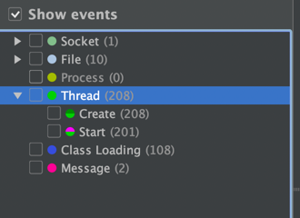
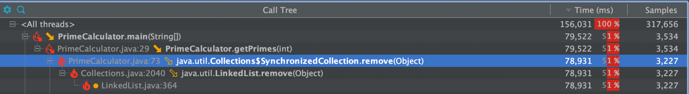
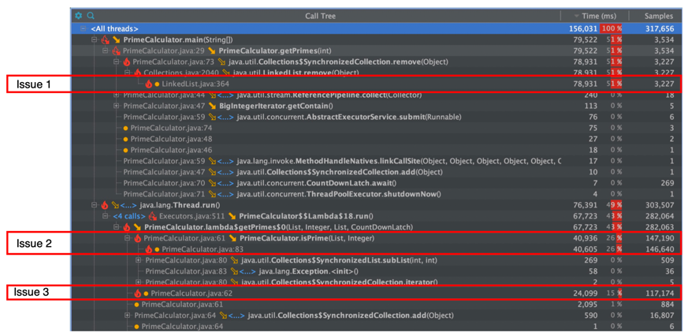
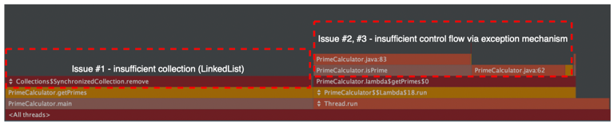
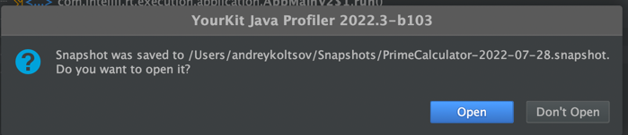
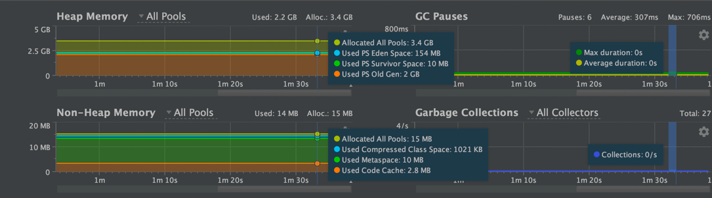
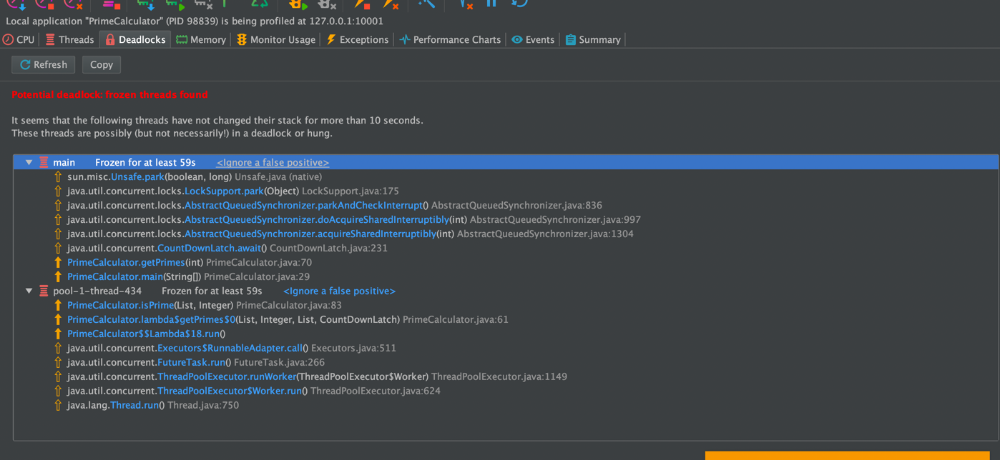
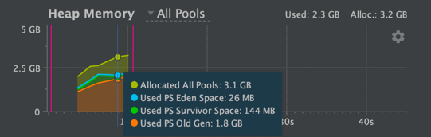

# Plan

1. Describe issues based on CPU and Memory analysis.
2. Create microbenchmark to simplify the comparison between the solutions.
3. Add code changes that'd enhance the performance.


# 1. Describe issues based on CPU and Memory analysis.
YourTrack had been used via Intellij IDEA. The IntelliJ's run method had been excluded from profiling.


## 1.1 Experiment 1 - increase
Value changed: 100 -> 100000 in order to increase amount of samples collected.
As a result - Java OOM. Do we need to create that many threads? (certainly not)
It's such an expensive operation.
Starting from ~5000, on my macbook, I observed inability to create new thread (208 threads). It's abnormal and related to JVM configuration on my macbook,

```
Exception in thread "main" java.lang.OutOfMemoryError: unable to create new native thread
	at java.lang.Thread.$$YJP$$start0(Native Method)
	at java.lang.Thread.start0(Thread.java)
	at java.lang.Thread.start(Thread.java:719)
	at java.util.concurrent.ThreadPoolExecutor.addWorker(ThreadPoolExecutor.java:957)
	at java.util.concurrent.ThreadPoolExecutor.execute(ThreadPoolExecutor.java:1367)
	at java.util.concurrent.AbstractExecutorService.submit(AbstractExecutorService.java:112)
	at PrimeCalculator.getPrimes(PrimeCalculator.java:55)
	at PrimeCalculator.main(PrimeCalculator.java:29)
Error occurred during initialization of VM
java.lang.OutOfMemoryError: unable to create new native thread

Process finished with exit code 1
```


Abnormal due ot amount of threads mac could handle
``` 
% sysctl kern.num_threads
kern.num_threads: 10240
```
Basically ulimit controls resources available to the shell and its processes, where launchctl controls maximum resources to the system and its processes.
Looking at ulimit statistics for the current, we could see that the current limit is 1333 threads. Unix, by design, don't restrict the amount of processes a user could spawn.,
```
andreykoltsov@Andreys-MacBook-Air ~ % ulimit -a
-t: cpu time (seconds)              unlimited
-f: file size (blocks)              unlimited
-d: data seg size (kbytes)          unlimited
-s: stack size (kbytes)             8176
-c: core file size (blocks)         0
-v: address space (kbytes)          unlimited
-l: locked-in-memory size (kbytes)  unlimited
-u: processes                       1333
-n: file descriptors                2560
```

Kernel limit is 2k, thus its max available hard limit for all users:
```
 sysctl -a |grep kern | grep proc
kern.maxproc: 2000
```

To make persistent change in MacOS for kernel parameters, we could modify launch daemon:
```

$ sudo vi /Library/LaunchDaemons/com.startup.sysctl.plist
<?xml version="1.0" encoding="UTF-8"?>
<!DOCTYPE plist PUBLIC "-//Apple//DTD PLIST 1.0//EN" "http://www.apple.com/DTDs/PropertyList-1.0.dtd">
<plist version="1.0">
<dict>
    <key>Label</key>
    <string>com.startup.sysctl</string>
    <key>LaunchOnlyOnce</key>
    <true/>
    <key>ProgramArguments</key>
    <array>
        <string>/usr/sbin/sysctl</string>
        <string>kern.maxproc=50000</string>
    </array>
    <key>RunAtLoad</key>
    <true/>
</dict>
</plist>

```

To apply launch daemon changes:
```
chown root:wheel /Library/LaunchDaemons/com.startup.sysctl.plist
launchctl load /Library/LaunchDaemons/com.startup.sysctl.plist
```
... but it didn't work on BigSur - the limit had stayed to be 2k.

Looking at launchctl statistics, we could see that soft limit for processes is 1.3k and hard limit is 2k
```
sudo launchctl limit
        cpu         unlimited      unlimited      
        filesize    unlimited      unlimited      
        data        unlimited      unlimited      
        stack       8372224        67092480       
        core        0              unlimited      
        rss         unlimited      unlimited      
        memlock     unlimited      unlimited      
        maxproc     1333           2000           
        maxfiles    256            unlimited      
```

Let's change it: 
```
sudo launchctl limit maxproc 20000 100000

```
In order to have an efficient benchmarking, let's update the amount of processes that current user could spawn up to 100k.
```
ulimit -u 100000
```

MacOS could be ran in server performance mode (https://apple.stackexchange.com/questions/373035/fix-fork-resource-temporarily-unavailable-on-os-x-macos/373036#373036)
```
sudo nvram boot-args="serverperfmode=1 $(nvram boot-args 2>/dev/null | cut -f 2-)"
```
Afterwards, aount of threads finally increased:
```
sudo sysctl kern.num_threads
kern.num_threads: 10240
```

Afterwards, in order to let JVM use these processes, I've increased user limit:
```
sudo launchctl limit maxproc 10000 10000
```

Afterwards, the change of user limit worked without any error:
```
sudo ulimit -u 10000
```

Since the change is only possible to make under 'root', I've re-launched Idea via `sudo`:
```
sudo /Applications/IntelliJ\ IDEA\ CE.app/Contents/MacOS/idea
```

As a result, experiment had been run with custom JVM options in order to increase heap size.



# 1. Default implementation
* Argument: 500000 (for sufficient sample size)
* JVM options: `-XX:+UnlockDiagnosticVMOptions -XX:+PrintFlagsFinal -Xmx4000m` (otherwise Java OOM)
* Thread liimt: amount of threads had been changed due to system limitations: 3000 -> 1500 (inability to create native thread), 
## 1.1 CPU analysis (Code had been modified to use fixed amount of threads) - general


A more simple view would be in the form of flamegraph:

Found issues:
* Issue 1. The sampling matches part of the code responsible for the removal of the available prime numbers. They're stored within `LinkedList` - an insufficient collection for such case, since each removal require traversing, which is implemented via O(N) lookup time. A more sufficient collection would be HashMap, since it provides O(1) lookup time.
* Issue 2 & 3. Both of them are related to insufficient control of application flow. Depending on stack trace, stack depth and its type, the creation of `Exception` instance is expensive. In an environment where they're constantly created in order to control the application flow, the affection on performance (CPU, Heap and, as a result, GC) is inevitable. As an alternative, we should replace the signature to use `boolean` variable.


## 1.2 CPU analysis - side-effects


## 1.2 Heap analysis
Heap usage is insufficient for such application.


## 1.3 Lock analysis
### 1.3.1 Redundant synchronization
Synchronized collections are expensive. In the original implementation, `primeNumbers` are accessed by a single thread to append it.
Reading is done in multithreaded environment, however, since Collection is not modified, syncronization is not mandatory.
```
   List<Integer> primeNumbers = Collections.synchronizedList(new LinkedList<>());

```
### 1.3.2 potential deadlock
Potential deadlock (probably thread is frozen due to GC activity and not an actual deadlock)


### 1.3.3 Excessive amount of threads
By default, we create threadpool with 3000 threads or more. Apart from issues with JVMs running on machines with low amount of cores, 
it leads to excessive context switching.
```
...
ExecutorService executors = Executors.newFixedThreadPool(Math.max(maxPrime / 100, 3000));
...
```

## 1.4 RAM Analysis

* Enabled Memory Snapshot capturing along with allocation profiling.
* Significant heap space is used due to excessive allocation of objects.
* 
Excessive allocation of objects could be found in:
* BigInteger iterator. The collection could be populated without this object. The class could be removed. Not to mention the initial allocation of ArrayList size within the class - 500 might be insufficient, however, it's relatively small number for most of the machines.
```
        List<BigIntegerIterator> myFiller = Stream.generate(new Supplier<BigIntegerIterator>() {
            ...
        }).limit(maxPrime).collect(Collectors.toList());

        for (BigIntegerIterator integer : myFiller) {
            primeNumbers.add(integer.getContain());
        }
        ...
        
```
* Exceptions. As stated in "CPU" section, that could be eliminated.
```
private static void isPrime(List<Integer> primeNumbers, Integer candidate) throws Exception {
        for (Integer j : primeNumbers.subList(0, candidate - 2)) {
            if (candidate % j == 0) {
                throw new Exception();
            }
...
            
```
* subList(...) method
```
    private static void isPrime(List<Integer> primeNumbers, Integer candidate) throws Exception {
        for (Integer j : primeNumbers.subList(0, candidate - 2)) {
        ...
```


# 2. Create benchmark to simplify comparison between soliutions

[JMH](https://github.com/openjdk/jmh) is a Java harness for building, running, and analysing nano/micro/milli/macro benchmarks written in Java and other languages targeting the JVM.
Latest available JMH build (1.56) as of August 2022 had been taken. Source: https://mvnrepository.com/artifact/org.openjdk.jmh/jmh-core/1.35

We'd include 2 dependencies: JMH core (business logic) and JMH annotation processor (simplification of execution)

## 2.1 Configuration

# 2.1.1 Behnchmark type

JMH has the following modes of execution ([java doc](http://javadox.com/org.openjdk.jmh/jmh-core/0.8/org/openjdk/jmh/annotations/Mode.html)):
* **Throughput** - measures the number of operations per second - number of times per second the method could be executed. Given the nature of the application (concurrent detect of numbers), that'd be better to focus on latency rather than throughput.
* **Average time** - measures average time for a single execution. "Average" wouldn't be an efficient metric due to GC pauses. It would be much convinient to use percentiles.
* **Sample time** - measures how long time it takes for the benchmark method to execute, including max, min time etc. A distribution of the values should be convinient for our case.
* **Single shot time** - measures how long time a single benchmark method execution takes to run, which doesn't include JVM warm up. Given the nature of our application, a single method execution should be sufficient measurement.
* **All** - runs all benchmark modes. This is mostly useful for internal JMH testing.
* 
Based on java doc for SingleShotTime:
```
Caveats for this mode include:
- More warmup/measurement iterations are generally required.
- Timers overhead might be significant if benchmarks are small; switch to SampleTime mode if that is a problem.

```

System.out.println (standard output) had been excluded from measurement, since the ways to provide the results may vary (serialization, send over the wire, etc.)

### 2.1.2 Warmup
When benchmarking JVM applications, warmup provides a more stable results. Once class loading is complete, all classes that're used during the bootstrap are pushed onto JVM cache, which makes them faster at runtime, while other classes are loaded on per-request basis.
The first invokation of application (in our case - prime numbers fetcher) would be slower than the following ones. During the initial execution, additional time would be taken to lazy class loading and JIT.
Thus, that'd be useful to cache all classes beforehand, thus they'd be instantly accessed at runtime. 


## 2.2 Execution

### 2.2.1 Original solution


# 3. Code enhancements
1. isPrime(...) signature is insufficient. It could be replaces with boolean rather than throwing and handlng excewption.


# 4. Issues

## 1.1 Unable to start up JMG
```
Exception in thread "main" java.lang.RuntimeException: ERROR: Unable to find the resource: /META-INF/BenchmarkList
```

No matching benchmarks. Miss-spelled regexp?
Use EXTRA verbose mode to debug the pattern matching.
```aidl

```
