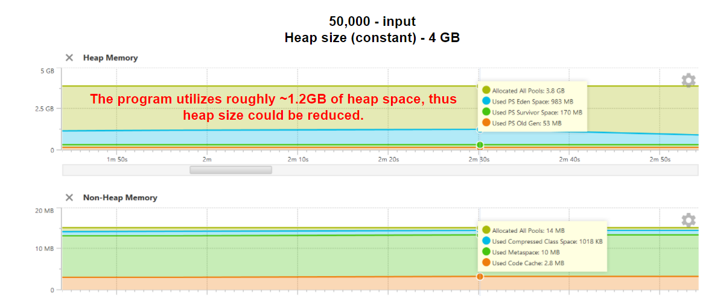

# Plan

1. Describe issues based on CPU and Memory analysis.
2. Create microbenchmark to simplify the comparison between the solutions.
3. Add code changes that'd enhance the performance.


# 1. Set up 
YourTrack had been used via Intellij IDEA. The IntelliJ's run method had been excluded from profiling.

## Environment
TODO: Add details
1. MacBook Air M1
2. Windows Laptop

# CPU and Memory analysis.

## Execution environment
* Argument: 500000 (for sufficient sample size)
* JVM options: `-XX:+UnlockDiagnosticVMOptions -XX:+PrintFlagsFinal -Xmx4000m` (otherwise Java OOM)
* Thread limit: amount of threads had been changed due to system limitations: 3000 -> 1500 (inability to create native thread), 

## 1.1 CPU analysis - 500,000 numbers, 1500 threads
Considering issue observed within the environment (TODO: add reference to description), it was decided to hard-code the amount of threads within the pool.
```
public static List<Integer> getPrimes(int maxPrime) throws InterruptedException {
    // ExecutorService executors = Executors.newFixedThreadPool(Math.max(maxPrime / 100, 3000));
    ExecutorService executors = Executors.newFixedThreadPool(1500);
    ...
}
```
As an alternative step, I've tried to run the program with maximal prime numbers that'd align with the amount of maximal threads JVM within my environment could spawn.
Unfortunately, considering small sampling size, such approach was insufficient for CPU analysis.

Let's take a look at CPU snapshot ([500k-primes-1500-threads-PrimeCalculator-2022-07-28.snapshot](snapshots/500k-primes-1500-threads-PrimeCalculator-2022-07-28.snapshot)).


A more simple view would be in the form of flamegraph:

Found issues:
* **Issue 1.** The sampling matches part of the code responsible for the removal of the available prime numbers. They're stored within `LinkedList` - an insufficient collection for such case, since each removal require traversing, which is implemented via O(N) lookup time. A more sufficient collection would be HashMap, since it provides O(1) lookup time.
* **Issue 2 & 3**. Both of them are related to insufficient control of application flow. Depending on stack trace, stack depth and its type, the creation of `Exception` instance is expensive. In an environment where they're constantly created in order to control the application flow, the affection on performance (CPU, Heap and, as a result, GC) is inevitable. As an alternative, we should replace the signature to use `boolean` variable.


Snapshot: [500k-primes-1500-threads-PrimeCalculator-2022-07-28.snapshot](snapshots/500k-primes-1500-threads-PrimeCalculator-2022-07-28.snapshot)

## 1.2 CPU analysis - 50,000 numbers, 50,000 threads
The solution was launched within other environment, where JVM is capable of having ~50,000 threads.




Snapshot: [50k-primes-cpu-PrimeCalculator.snapshot](snapshots/50k-primes-cpu-PrimeCalculator.snapshot)

## 1.2 Heap analysis
Heap usage is insufficient for such application.


## 1.3 Lock analysis
### 1.3.1 Redundant synchronization
Synchronized collections are expensive. In the original implementation, `primeNumbers` are accessed by a single thread to append it.
Reading is done in multithreaded environment, however, since Collection is not modified, synchronization is not mandatory.
```
   List<Integer> primeNumbers = Collections.synchronizedList(new LinkedList<>());

```
### 1.3.2 potential deadlock
Potential deadlock (probably thread is frozen due to GC activity and not an actual deadlock)


### 1.3.3 Excessive amount of threads
By default, we create thread-pool with 3000 threads or more. Apart from issues with JVMs running on machines with low amount of cores, 
it leads to excessive context switching.
```
...
ExecutorService executors = Executors.newFixedThreadPool(Math.max(maxPrime / 100, 3000));
...
```

## 1.4 RAM Analysis

* Enabled Memory Snapshot capturing along with allocation profiling.
* Significant heap space is used due to excessive allocation of objects.
* 
Excessive allocation of objects could be found in:
* BigInteger iterator. The collection could be populated without this object. The class could be removed. Not to mention the initial allocation of ArrayList size within the class - 500 might be insufficient, however, it's relatively small number for most of the machines.
```
        List<BigIntegerIterator> myFiller = Stream.generate(new Supplier<BigIntegerIterator>() {
            ...
        }).limit(maxPrime).collect(Collectors.toList());

        for (BigIntegerIterator integer : myFiller) {
            primeNumbers.add(integer.getContain());
        }
        ...
        
```
* Exceptions. As stated in "CPU" section, that could be eliminated.
```
private static void isPrime(List<Integer> primeNumbers, Integer candidate) throws Exception {
        for (Integer j : primeNumbers.subList(0, candidate - 2)) {
            if (candidate % j == 0) {
                throw new Exception();
            }
...
            
```
* subList(...) method
```
    private static void isPrime(List<Integer> primeNumbers, Integer candidate) throws Exception {
        for (Integer j : primeNumbers.subList(0, candidate - 2)) {
        ...
```


# 2. Automation - benchmark for comparison between the solutions

Java Profiling is useful for the investigation of application's behavior: resource (CPU / RAM / Heap / off-heap) consumption, allocation, state of threads.
In context of performance, using this data, we might determine the factors that slow down application's execution, yet it wouldn't be highly useful when comparing performance of 2 different build from user perspective.

Instead of comparing CPU sampling data, that would be sufficient to compare the latency of operations within our business logic. That could be achieved in case a custom benchmark would be implemented.

## 2.1 Tools
[JMH](https://github.com/openjdk/jmh) is a Java harness for building, running, and analysing nano/micro/milli/macro benchmarks written in Java and other languages targeting the JVM.
Latest available JMH build (1.56) as of August 2022 had been taken. Source: https://mvnrepository.com/artifact/org.openjdk.jmh/jmh-core/1.35

We'd include 2 dependencies: JMH core (business logic) and JMH annotation processor (simplification of execution)

## 2.2 Configuration
The section describes core configuration options for the implemented automated solution - benchmark that uses JVM.

# 2.1.1 Benchmark type
JMH has the following modes of execution ([java doc](http://javadox.com/org.openjdk.jmh/jmh-core/0.8/org/openjdk/jmh/annotations/Mode.html)):
* **Throughput** - measures the number of operations per second - number of times per second the method could be executed. Given the nature of the application (concurrent detect of numbers), that'd be better to focus on latency rather than throughput.
* **Average time** - measures average time for a single execution. "Average" wouldn't be an efficient metric due to GC pauses. It would be much convenient to use percentiles.
* **Sample time** - measures how long time it takes for the benchmark method to execute, including max, min time etc. A distribution of the values should be convenient for our case.
* **Single shot time** - measures how long time a single benchmark method execution takes to run, which doesn't include JVM warm up. Given the nature of our application, a single method execution should be sufficient measurement.
* **All** - runs all benchmark modes. This is mostly useful for internal JMH testing.

The runtime of benchmark might include internment pauses, such as GC Stop The World event. Therefore, "average", which would include GC pauses, `SingleShotTime`:
```
Caveats for this mode include:
- More warmup/measurement iterations are generally required.
- Timers overhead might be significant if benchmarks are small; switch to SampleTime mode if that is a problem.
```


### 2.1.2 Warmup
When benchmarking JVM applications, warmup provides a more stable results. Once class loading is complete, all classes used during the bootstrap are pushed onto JVM cache, which makes them faster at runtime, while other classes are loaded on per-request basis.
The first invocation of application (in our case - prime numbers' fetcher) would be slower than the following ones. During the initial execution, additional time would be taken to lazy class loading and JIT.
Thus, that'd be useful to cache all classes beforehand, thus they'd be instantly accessed at runtime. 

### 2.1.3 Avoiding dead code elimination by JVM
JVM might detect that the result of the benchmarking method is not used anywhere. As a result, that'd apply optimizations.
Consider the fact we'd want to focus on "real" use cases, that would provide insufficient results.
JVM provides `Blackhole` object, which might be used as a consumer of the result. Therefore, we'd prevent JVM's optimization related to the unused code.
### 2.1.4 SetUp / TearDown
Given the nature of the original method and the fact it generates sequence of the numbers on demand, no set up or tear down actions are needed.

## 2.2 Execution
JVM options: `-Xms4096m -Xmx4096m`
### 2.2.1 Original solution


# 3. Code enhancements
1. isPrime(...) signature is insufficient. It could be replaced with boolean rather than throwing and handling exception.

## 3.1 Thread execution
Regular thread pool has one queue. Each thread from the pool locks the queue, dequeue a task and remove the lock.
In case a task is short (non-IO-bound), there's a lot of contention within the queue.
It's possible to use a lock-free solution, but it doesn't solve the problem entirely.

In work-stealing techniques, each thread has its own queue. In case it runs out of tasks - it "steals" the tasks from other threads. Thus, the contention between threads is lower.

One of these thread pool is Java is `newWorkStrealingPool`. It's worth to mention that there's 1 use case that makes it less efficient - synchronous I/O.
In that case, the cores wouldn't be utilized, as the thread will be waiting for the I/O to finish. An alternative to that would be `ForkJoinPool`, since it keeps all threads within pool active at any given moment of time, which saturates CPU.
Considering the context of this task, we don't expect any synchronous I/O, thus `newWorkStealingPool` should be sufficient.

Based on different JVM implementations, `newWorkStrealingPool` might be a pre-configured `ForkJoinPool`.

(!) Thread pool's capacity depends on the environment (cores, JVM limits for available processes, etc.). Assuming that'd be a part of server-side logic, instead of hard-coding the value or multiplies based on available cores, I'd let user specify it via configuration options.

## [enhanced] for-loop optimization
In for loop:
```
private static boolean isPrime(int number) {
...

        for (int i = 2; i < number; i++) {
           ...
        }
...
```
We don't need to check even numbers. Thus, instead iterating one-by-one, we could iterate one-by-two.
# 4. Issues

## 1.1 Unable to start up JMG
```
Exception in thread "main" java.lang.RuntimeException: ERROR: Unable to find the resource: /META-INF/BenchmarkList
```

No matching benchmarks. Miss-spelled regexp?
Use EXTRA verbose mode to debug the pattern matching.
```aidl

```

# Experiments
System.out.println (standard output) had been excluded from measurement, since the ways to provide the results may vary (serialization, send over the wire, etc.)

## 100, 500 - 1st enhanced implementation
```
        @Param({"100", "500"})

Benchmark                                                                        (iterations)    Mode    Cnt    Score   Error  Units
CalculatorBenchmark.runEnhancedBenchmark                                                  100  sample  16998    2.940 ± 0.010  ms/op
CalculatorBenchmark.runEnhancedBenchmark:runEnhancedBenchmark·p0.00                       100  sample           1.987          ms/op
CalculatorBenchmark.runEnhancedBenchmark:runEnhancedBenchmark·p0.50                       100  sample           2.886          ms/op
CalculatorBenchmark.runEnhancedBenchmark:runEnhancedBenchmark·p0.90                       100  sample           3.420          ms/op
CalculatorBenchmark.runEnhancedBenchmark:runEnhancedBenchmark·p0.95                       100  sample           3.641          ms/op
CalculatorBenchmark.runEnhancedBenchmark:runEnhancedBenchmark·p0.99                       100  sample           4.162          ms/op
CalculatorBenchmark.runEnhancedBenchmark:runEnhancedBenchmark·p0.999                      100  sample           4.825          ms/op
CalculatorBenchmark.runEnhancedBenchmark:runEnhancedBenchmark·p0.9999                     100  sample           7.289          ms/op
CalculatorBenchmark.runEnhancedBenchmark:runEnhancedBenchmark·p1.00                       100  sample           8.471          ms/op
CalculatorBenchmark.runEnhancedBenchmark                                                  500  sample   2250   22.235 ± 0.153  ms/op
CalculatorBenchmark.runEnhancedBenchmark:runEnhancedBenchmark·p0.00                       500  sample          12.796          ms/op
CalculatorBenchmark.runEnhancedBenchmark:runEnhancedBenchmark·p0.50                       500  sample          22.249          ms/op
CalculatorBenchmark.runEnhancedBenchmark:runEnhancedBenchmark·p0.90                       500  sample          24.248          ms/op
CalculatorBenchmark.runEnhancedBenchmark:runEnhancedBenchmark·p0.95                       500  sample          25.166          ms/op
CalculatorBenchmark.runEnhancedBenchmark:runEnhancedBenchmark·p0.99                       500  sample          29.734          ms/op
CalculatorBenchmark.runEnhancedBenchmark:runEnhancedBenchmark·p0.999                      500  sample          33.735          ms/op
CalculatorBenchmark.runEnhancedBenchmark:runEnhancedBenchmark·p0.9999                     500  sample          34.669          ms/op
CalculatorBenchmark.runEnhancedBenchmark:runEnhancedBenchmark·p1.00                       500  sample          34.669          ms/op
CalculatorBenchmark.runOriginalImplementation                                             100  sample  16854    2.966 ± 0.045  ms/op
CalculatorBenchmark.runOriginalImplementation:runOriginalImplementation·p0.00             100  sample           2.109          ms/op
CalculatorBenchmark.runOriginalImplementation:runOriginalImplementation·p0.50             100  sample           2.920          ms/op
CalculatorBenchmark.runOriginalImplementation:runOriginalImplementation·p0.90             100  sample           3.142          ms/op
CalculatorBenchmark.runOriginalImplementation:runOriginalImplementation·p0.95             100  sample           3.265          ms/op
CalculatorBenchmark.runOriginalImplementation:runOriginalImplementation·p0.99             100  sample           3.822          ms/op
CalculatorBenchmark.runOriginalImplementation:runOriginalImplementation·p0.999            100  sample           6.754          ms/op
CalculatorBenchmark.runOriginalImplementation:runOriginalImplementation·p0.9999           100  sample          82.662          ms/op
CalculatorBenchmark.runOriginalImplementation:runOriginalImplementation·p1.00             100  sample         229.376          ms/op
CalculatorBenchmark.runOriginalImplementation                                             500  sample   2263   22.115 ± 0.106  ms/op
CalculatorBenchmark.runOriginalImplementation:runOriginalImplementation·p0.00             500  sample          14.189          ms/op
CalculatorBenchmark.runOriginalImplementation:runOriginalImplementation·p0.50             500  sample          22.151          ms/op
CalculatorBenchmark.runOriginalImplementation:runOriginalImplementation·p0.90             500  sample          23.560          ms/op
CalculatorBenchmark.runOriginalImplementation:runOriginalImplementation·p0.95             500  sample          24.445          ms/op
CalculatorBenchmark.runOriginalImplementation:runOriginalImplementation·p0.99             500  sample          26.369          ms/op
CalculatorBenchmark.runOriginalImplementation:runOriginalImplementation·p0.999            500  sample          29.614          ms/op
CalculatorBenchmark.runOriginalImplementation:runOriginalImplementation·p0.9999           500  sample          30.507          ms/op
CalculatorBenchmark.runOriginalImplementation:runOriginalImplementation·p1.00             500  sample          30.507          ms/op

```

Test with more steps -  @Param({"100", "1000", "2000"}):
```
CalculatorBenchmark.runEnhancedBenchmark                                                  100  sample  176391    0.283 ± 0.004  ms/op
CalculatorBenchmark.runEnhancedBenchmark:runEnhancedBenchmark·p0.00                       100  sample            0.121          ms/op
CalculatorBenchmark.runEnhancedBenchmark:runEnhancedBenchmark·p0.50                       100  sample            0.236          ms/op
CalculatorBenchmark.runEnhancedBenchmark:runEnhancedBenchmark·p0.90                       100  sample            0.309          ms/op
CalculatorBenchmark.runEnhancedBenchmark:runEnhancedBenchmark·p0.95                       100  sample            0.516          ms/op
CalculatorBenchmark.runEnhancedBenchmark:runEnhancedBenchmark·p0.99                       100  sample            0.946          ms/op
CalculatorBenchmark.runEnhancedBenchmark:runEnhancedBenchmark·p0.999                      100  sample            4.940          ms/op
CalculatorBenchmark.runEnhancedBenchmark:runEnhancedBenchmark·p0.9999                     100  sample           28.225          ms/op
CalculatorBenchmark.runEnhancedBenchmark:runEnhancedBenchmark·p1.00                       100  sample           43.647          ms/op
CalculatorBenchmark.runEnhancedBenchmark                                                 1000  sample  138966    0.360 ± 0.006  ms/op
CalculatorBenchmark.runEnhancedBenchmark:runEnhancedBenchmark·p0.00                      1000  sample            0.201          ms/op
CalculatorBenchmark.runEnhancedBenchmark:runEnhancedBenchmark·p0.50                      1000  sample            0.295          ms/op
CalculatorBenchmark.runEnhancedBenchmark:runEnhancedBenchmark·p0.90                      1000  sample            0.406          ms/op
CalculatorBenchmark.runEnhancedBenchmark:runEnhancedBenchmark·p0.95                      1000  sample            0.598          ms/op
CalculatorBenchmark.runEnhancedBenchmark:runEnhancedBenchmark·p0.99                      1000  sample            0.966          ms/op
CalculatorBenchmark.runEnhancedBenchmark:runEnhancedBenchmark·p0.999                     1000  sample            7.901          ms/op
CalculatorBenchmark.runEnhancedBenchmark:runEnhancedBenchmark·p0.9999                    1000  sample           37.581          ms/op
CalculatorBenchmark.runEnhancedBenchmark:runEnhancedBenchmark·p1.00                      1000  sample           48.628          ms/op
CalculatorBenchmark.runEnhancedBenchmark                                                 2000  sample   92922    0.538 ± 0.009  ms/op
CalculatorBenchmark.runEnhancedBenchmark:runEnhancedBenchmark·p0.00                      2000  sample            0.294          ms/op
CalculatorBenchmark.runEnhancedBenchmark:runEnhancedBenchmark·p0.50                      2000  sample            0.435          ms/op
CalculatorBenchmark.runEnhancedBenchmark:runEnhancedBenchmark·p0.90                      2000  sample            0.694          ms/op
CalculatorBenchmark.runEnhancedBenchmark:runEnhancedBenchmark·p0.95                      2000  sample            0.837          ms/op
CalculatorBenchmark.runEnhancedBenchmark:runEnhancedBenchmark·p0.99                      2000  sample            2.159          ms/op
CalculatorBenchmark.runEnhancedBenchmark:runEnhancedBenchmark·p0.999                     2000  sample            9.866          ms/op
CalculatorBenchmark.runEnhancedBenchmark:runEnhancedBenchmark·p0.9999                    2000  sample           24.720          ms/op
CalculatorBenchmark.runEnhancedBenchmark:runEnhancedBenchmark·p1.00                      2000  sample          151.257          ms/op


CalculatorBenchmark.runOriginalImplementation                                             100  sample   14349    3.483 ± 0.022  ms/op
CalculatorBenchmark.runOriginalImplementation:runOriginalImplementation·p0.00             100  sample            2.208          ms/op
CalculatorBenchmark.runOriginalImplementation:runOriginalImplementation·p0.50             100  sample            3.265          ms/op
CalculatorBenchmark.runOriginalImplementation:runOriginalImplementation·p0.90             100  sample            4.325          ms/op
CalculatorBenchmark.runOriginalImplementation:runOriginalImplementation·p0.95             100  sample            4.792          ms/op
CalculatorBenchmark.runOriginalImplementation:runOriginalImplementation·p0.99             100  sample            5.702          ms/op
CalculatorBenchmark.runOriginalImplementation:runOriginalImplementation·p0.999            100  sample           12.780          ms/op
CalculatorBenchmark.runOriginalImplementation:runOriginalImplementation·p0.9999           100  sample           27.199          ms/op
CalculatorBenchmark.runOriginalImplementation:runOriginalImplementation·p1.00             100  sample           28.967          ms/op
CalculatorBenchmark.runOriginalImplementation                                            1000  sample     570   87.950 ± 1.868  ms/op
CalculatorBenchmark.runOriginalImplementation:runOriginalImplementation·p0.00            1000  sample           43.713          ms/op
CalculatorBenchmark.runOriginalImplementation:runOriginalImplementation·p0.50            1000  sample           84.935          ms/op
CalculatorBenchmark.runOriginalImplementation:runOriginalImplementation·p0.90            1000  sample          106.693          ms/op
CalculatorBenchmark.runOriginalImplementation:runOriginalImplementation·p0.95            1000  sample          110.625          ms/op
CalculatorBenchmark.runOriginalImplementation:runOriginalImplementation·p0.99            1000  sample          121.694          ms/op
CalculatorBenchmark.runOriginalImplementation:runOriginalImplementation·p0.999           1000  sample          126.747          ms/op
CalculatorBenchmark.runOriginalImplementation:runOriginalImplementation·p0.9999          1000  sample          126.747          ms/op
CalculatorBenchmark.runOriginalImplementation:runOriginalImplementation·p1.00            1000  sample          126.747          ms/op
```

# Thread count test
Thread count test:
```
Thread count: 4041
Thread count: 4043
Thread count: 4045
Thread count: 4047
Thread count: 4049
Thread count: 4051
```

# Task-unrelated notes

## MacBook Air M1 - thread limitations
Value changed: 100 -> 100000 in order to increase amount of samples collected.

As a result - Java OOM. Do we need to create that many threads? (certainly not)
It's such an expensive operation.
Starting from ~5000, on my macbook, I observed inability to create new thread (208 threads). It's abnormal and related to JVM configuration on my macbook,

```
Exception in thread "main" java.lang.OutOfMemoryError: unable to create new native thread
	at java.lang.Thread.$$YJP$$start0(Native Method)
	at java.lang.Thread.start0(Thread.java)
	at java.lang.Thread.start(Thread.java:719)
	at java.util.concurrent.ThreadPoolExecutor.addWorker(ThreadPoolExecutor.java:957)
	at java.util.concurrent.ThreadPoolExecutor.execute(ThreadPoolExecutor.java:1367)
	at java.util.concurrent.AbstractExecutorService.submit(AbstractExecutorService.java:112)
	at PrimeCalculator.getPrimes(PrimeCalculator.java:55)
	at PrimeCalculator.main(PrimeCalculator.java:29)
Error occurred during initialization of VM
java.lang.OutOfMemoryError: unable to create new native thread

Process finished with exit code 1
```


Abnormal due ot amount of threads mac could handle
``` 
% sysctl kern.num_threads
kern.num_threads: 10240
```
Basically, `ulimit` controls resources available to the shell and its processes, where launchctl controls maximum resources to the system and its processes.
Looking at `ulimit` statistics for the current, we could see that the current limit is 1333 threads. Unix, by design, don't restrict the amount of processes a user could spawn.,
```
andreykoltsov@Andreys-MacBook-Air ~ % ulimit -a
-t: cpu time (seconds)              unlimited
-f: file size (blocks)              unlimited
-d: data seg size (kbytes)          unlimited
-s: stack size (kbytes)             8176
-c: core file size (blocks)         0
-v: address space (kbytes)          unlimited
-l: locked-in-memory size (kbytes)  unlimited
-u: processes                       1333
-n: file descriptors                2560
```

Kernel limit is 2k, thus its max available hard limit for all users:
```
 sysctl -a |grep kern | grep proc
kern.maxproc: 2000
```

To make persistent change in macOS for kernel parameters, we could modify launch daemon:
```

$ sudo vi /Library/LaunchDaemons/com.startup.sysctl.plist
<?xml version="1.0" encoding="UTF-8"?>
<!DOCTYPE plist PUBLIC "-//Apple//DTD PLIST 1.0//EN" "http://www.apple.com/DTDs/PropertyList-1.0.dtd">
<plist version="1.0">
<dict>
    <key>Label</key>
    <string>com.startup.sysctl</string>
    <key>LaunchOnlyOnce</key>
    <true/>
    <key>ProgramArguments</key>
    <array>
        <string>/usr/sbin/sysctl</string>
        <string>kern.maxproc=50000</string>
    </array>
    <key>RunAtLoad</key>
    <true/>
</dict>
</plist>

```

To apply launch daemon changes:
```
sudo chown root:wheel /Library/LaunchDaemons/com.startup.sysctl.plist
sudo launchctl load /Library/LaunchDaemons/com.startup.sysctl.plist
```
... but it didn't work on BigSur - the limit had stayed to be 2k.

Looking at launchctl statistics, we could see that soft limit for processes is 1.3k and hard limit is 2k
```
sudo launchctl limit
        cpu         unlimited      unlimited      
        filesize    unlimited      unlimited      
        data        unlimited      unlimited      
        stack       8372224        67092480       
        core        0              unlimited      
        rss         unlimited      unlimited      
        memlock     unlimited      unlimited      
        maxproc     1333           2000           
        maxfiles    256            unlimited      
```

Let's change it:
```
sudo launchctl limit maxproc 20000 100000

```
In order to have an efficient benchmarking, let's update the amount of processes that current user could spawn up to 100k.
```
ulimit -u 100000
```

MacOS could run in server performance mode (https://apple.stackexchange.com/questions/373035/fix-fork-resource-temporarily-unavailable-on-os-x-macos/373036#373036)
```
sudo nvram boot-args="serverperfmode=1 $(nvram boot-args 2>/dev/null | cut -f 2-)"
```
Afterwards, amount of threads finally increased:
```
sudo sysctl kern.num_threads
kern.num_threads: 10240
```

Afterwards, in order to let JVM use these processes, I've increased user limit:
```
sudo launchctl limit maxproc 10000 10000
```

Afterwards, the change of user limit worked without any error:
```
sudo ulimit -u 10000
```

Since the change is only possible to make under 'root', I've re-launched Idea via `sudo`:
```
sudo /Applications/IntelliJ\ IDEA\ CE.app/Contents/MacOS/idea
```

By default, each thread has 512kb in RAM. It could be changed using Xss.

As a result, experiment had been run with custom JVM options in order to increase heap size.

# Issues
## Idea - unterminated process in case native thread couldn't be created
(IDEA had been launched under `sudo`)
In case Java OOM had occurred:
```
Exception in thread "main" java.lang.OutOfMemoryError: unable to create new native thread
```
Intellij Idea seems to keep restarting the process - it keeps appearing within the system (ref.: `ps aux`)
Perhaps it's trying to create a heap dump?
When trying to close the IDEA, it keeps trying to death the process as well - it prevents it from successful termination of IDE.

After clicking "terminate", it tries to terminate the app, but didn't succeed.
Afterwards, I click "cancel" and repeat the process. Afterwards, the project is successfully closed.


# Execution of tests results - new Aug 6th - Windows laptop

The section contains details about conducted experiments and their configurations.

## Test configuration
Within environment, I've used, running the original implementation with more than 10,000 numbers results into the creation of an equal, 10,000 threads within the pool.
Given the use of `synchronized` keyword, multiple threads are spending significant amount of time waiting to acquire the lock, while new tasks are being send to executor service.

As a result, the application terminates with Java OOM, while the results are incomparable.

Therefore, I've decided to use the following inputs as an arguments for comparison between the solutions: "1000", "5000", "10000"

### Heap size
In case Java heap size is not constant, JVM would be adjusting heap size to keep a reasonably available free space (`MinHeapFreeRatio`, `MaxHeapFreeRatio`) for live object at each GC iteration. Details: [Java SE 8 documentation @ Oracle](https://docs.oracle.com/javase/8/docs/technotes/guides/vm/gctuning/sizing.html).

In order to increase repeatability of the results, it's possible to prevent JVM from making heap sizing decisions. In order to achieve that, within the test, minimal and maximal heap size had been set to 4GB each.

That had been achieved by the application of the following JVM options: `-Xms4000m -Xmx4000m`

## Determine baseline - benchmark original implementation
Prior to running the experiment with different versions of enhanced prime number calculator, that'd be useful to determine the baseline - results achieved by benchmarking the original implementation.

Therefore, comparing the results of further enhancements with the baseline, we'd be able to evaluate the enhancements committed to the original implementation.
``` 
Andrey, [6 Aug 2022, 16:15:10]:
CalculatorBenchmark.runOriginalImplementation:runOriginalImplementation�p0.00            1000  sample            93,061             ms/op
CalculatorBenchmark.runOriginalImplementation:runOriginalImplementation�p0.50            1000  sample           123,077             ms/op
CalculatorBenchmark.runOriginalImplementation:runOriginalImplementation�p0.90            1000  sample           135,476             ms/op
CalculatorBenchmark.runOriginalImplementation:runOriginalImplementation�p0.95            1000  sample           138,766             ms/op
CalculatorBenchmark.runOriginalImplementation:runOriginalImplementation�p0.99            1000  sample           149,336             ms/op
CalculatorBenchmark.runOriginalImplementation:runOriginalImplementation�p0.999           1000  sample           152,568             ms/op
CalculatorBenchmark.runOriginalImplementation:runOriginalImplementation�p0.9999          1000  sample           152,568             ms/op
CalculatorBenchmark.runOriginalImplementation:runOriginalImplementation�p1.00            1000  sample           152,568             ms/op
CalculatorBenchmark.runOriginalImplementation                                            5000  sample     27   2138,435 �  494,929  ms/op
CalculatorBenchmark.runOriginalImplementation:runOriginalImplementation�p0.00            5000  sample           667,943             ms/op
CalculatorBenchmark.runOriginalImplementation:runOriginalImplementation�p0.50            5000  sample          2210,398             ms/op
CalculatorBenchmark.runOriginalImplementation:runOriginalImplementation�p0.90            5000  sample          3135,662             ms/op
CalculatorBenchmark.runOriginalImplementation:runOriginalImplementation�p0.95            5000  sample          3339,505             ms/op
CalculatorBenchmark.runOriginalImplementation:runOriginalImplementation�p0.99            5000  sample          3368,026             ms/op
CalculatorBenchmark.runOriginalImplementation:runOriginalImplementation�p0.999           5000  sample          3368,026             ms/op
CalculatorBenchmark.runOriginalImplementation:runOriginalImplementation�p0.9999          5000  sample          3368,026             ms/op
CalculatorBenchmark.runOriginalImplementation:runOriginalImplementation�p1.00            5000  sample          3368,026             ms/op
CalculatorBenchmark.runOriginalImplementation                                           10000  sample      9   8719,026 � 4830,375  ms/op
CalculatorBenchmark.runOriginalImplementation:runOriginalImplementation�p0.00           10000  sample          3066,036             ms/op
CalculatorBenchmark.runOriginalImplementation:runOriginalImplementation�p0.50           10000  sample          9378,464             ms/op
CalculatorBenchmark.runOriginalImplementation:runOriginalImplementation�p0.90           10000  sample         13019,120             ms/op
CalculatorBenchmark.runOriginalImplementation:runOriginalImplementation�p0.95           10000  sample         13019,120             ms/op
CalculatorBenchmark.runOriginalImplementation:runOriginalImplementation�p0.99           10000  sample         13019,120             ms/op
CalculatorBenchmark.runOriginalImplementation:runOriginalImplementation�p0.999          10000  sample         13019,120             ms/op
CalculatorBenchmark.runOriginalImplementation:runOriginalImplementation�p0.9999         10000  sample         13019,120             ms/op
CalculatorBenchmark.runOriginalImplementation:runOriginalImplementation�p1.00           10000  sample         13019,120             ms/op
...
```

## Experiment - exceptions

Program flow is controller with exceptions. Using LinkedList, fixed thread pool, queue,
```
    public static List<Integer> getPrimes(int maxPrime) throws InterruptedException {
        ...
        executors.submit(() -> {
                try {
                    isPrime(candidate);
                    primeNumbersQueue.add(candidate);
                } catch (Exception e) {
                    // not a prime
                }
                latch.countDown();
            });
        ....
    }

    private static void isPrime(Integer number) throws Exception {
       ...
        if (number < 2 || number % 2 == 0) {
            throw new Exception();
        }
        ...
        for (int i = 3; i < number; i+= 2) {
            if (number % i == 0) {
                throw new Exception();
            }
        }
        ...
    }
    
```


Results:

```
Benchmark                                                              (iterations)    Mode    Cnt   Score   Error  Units
CalculatorBenchmark.runEnhancedBenchmark                                       1000  sample  31803   1,571 � 0,004  ms/op
CalculatorBenchmark.runEnhancedBenchmark:runEnhancedBenchmark�p0.00            1000  sample          1,112          ms/op
CalculatorBenchmark.runEnhancedBenchmark:runEnhancedBenchmark�p0.50            1000  sample          1,528          ms/op
CalculatorBenchmark.runEnhancedBenchmark:runEnhancedBenchmark�p0.90            1000  sample          1,778          ms/op
CalculatorBenchmark.runEnhancedBenchmark:runEnhancedBenchmark�p0.95            1000  sample          1,935          ms/op
CalculatorBenchmark.runEnhancedBenchmark:runEnhancedBenchmark�p0.99            1000  sample          2,482          ms/op
CalculatorBenchmark.runEnhancedBenchmark:runEnhancedBenchmark�p0.999           1000  sample          2,967          ms/op
CalculatorBenchmark.runEnhancedBenchmark:runEnhancedBenchmark�p0.9999          1000  sample          4,053          ms/op
CalculatorBenchmark.runEnhancedBenchmark:runEnhancedBenchmark�p1.00            1000  sample          4,841          ms/op
CalculatorBenchmark.runEnhancedBenchmark                                       5000  sample   9075   5,507 � 0,020  ms/op
CalculatorBenchmark.runEnhancedBenchmark:runEnhancedBenchmark�p0.00            5000  sample          4,235          ms/op
CalculatorBenchmark.runEnhancedBenchmark:runEnhancedBenchmark�p0.50            5000  sample          5,390          ms/op
CalculatorBenchmark.runEnhancedBenchmark:runEnhancedBenchmark�p0.90            5000  sample          6,259          ms/op
CalculatorBenchmark.runEnhancedBenchmark:runEnhancedBenchmark�p0.95            5000  sample          6,586          ms/op
CalculatorBenchmark.runEnhancedBenchmark:runEnhancedBenchmark�p0.99            5000  sample          7,391          ms/op
CalculatorBenchmark.runEnhancedBenchmark:runEnhancedBenchmark�p0.999           5000  sample          8,921          ms/op
CalculatorBenchmark.runEnhancedBenchmark:runEnhancedBenchmark�p0.9999          5000  sample         23,101          ms/op
CalculatorBenchmark.runEnhancedBenchmark:runEnhancedBenchmark�p1.00            5000  sample         23,101          ms/op
CalculatorBenchmark.runEnhancedBenchmark                                      10000  sample   4623  10,813 � 0,036  ms/op
CalculatorBenchmark.runEnhancedBenchmark:runEnhancedBenchmark�p0.00           10000  sample          8,831          ms/op
CalculatorBenchmark.runEnhancedBenchmark:runEnhancedBenchmark�p0.50           10000  sample         10,699          ms/op
CalculatorBenchmark.runEnhancedBenchmark:runEnhancedBenchmark�p0.90           10000  sample         11,715          ms/op
CalculatorBenchmark.runEnhancedBenchmark:runEnhancedBenchmark�p0.95           10000  sample         12,321          ms/op
CalculatorBenchmark.runEnhancedBenchmark:runEnhancedBenchmark�p0.99           10000  sample         13,398          ms/op
CalculatorBenchmark.runEnhancedBenchmark:runEnhancedBenchmark�p0.999          10000  sample         14,424          ms/op
CalculatorBenchmark.runEnhancedBenchmark:runEnhancedBenchmark�p0.9999         10000  sample         14,844          ms/op
CalculatorBenchmark.runEnhancedBenchmark:runEnhancedBenchmark�p1.00           10000  sample         14,844          ms/op
```
## Experiment - LinkedList
```
List<Integer> primeNumbersQueue = Collections.synchronizedList(new LinkedList<>());
```

Results:
```
Benchmark                                                              (iterations)    Mode    Cnt   Score   Error  Units
CalculatorBenchmark.runEnhancedBenchmark                                       1000  sample  50096   0,997 � 0,003  ms/op
CalculatorBenchmark.runEnhancedBenchmark:runEnhancedBenchmark�p0.00            1000  sample          0,673          ms/op
CalculatorBenchmark.runEnhancedBenchmark:runEnhancedBenchmark�p0.50            1000  sample          0,954          ms/op
CalculatorBenchmark.runEnhancedBenchmark:runEnhancedBenchmark�p0.90            1000  sample          1,128          ms/op
CalculatorBenchmark.runEnhancedBenchmark:runEnhancedBenchmark�p0.95            1000  sample          1,251          ms/op
CalculatorBenchmark.runEnhancedBenchmark:runEnhancedBenchmark�p0.99            1000  sample          1,878          ms/op
CalculatorBenchmark.runEnhancedBenchmark:runEnhancedBenchmark�p0.999           1000  sample          2,424          ms/op
CalculatorBenchmark.runEnhancedBenchmark:runEnhancedBenchmark�p0.9999          1000  sample          4,391          ms/op
CalculatorBenchmark.runEnhancedBenchmark:runEnhancedBenchmark�p1.00            1000  sample         16,302          ms/op
CalculatorBenchmark.runEnhancedBenchmark                                       5000  sample  17284   2,891 � 0,008  ms/op
CalculatorBenchmark.runEnhancedBenchmark:runEnhancedBenchmark�p0.00            5000  sample          2,220          ms/op
CalculatorBenchmark.runEnhancedBenchmark:runEnhancedBenchmark�p0.50            5000  sample          2,826          ms/op
CalculatorBenchmark.runEnhancedBenchmark:runEnhancedBenchmark�p0.90            5000  sample          3,281          ms/op
CalculatorBenchmark.runEnhancedBenchmark:runEnhancedBenchmark�p0.95            5000  sample          3,473          ms/op
CalculatorBenchmark.runEnhancedBenchmark:runEnhancedBenchmark�p0.99            5000  sample          3,961          ms/op
CalculatorBenchmark.runEnhancedBenchmark:runEnhancedBenchmark�p0.999           5000  sample          4,837          ms/op
CalculatorBenchmark.runEnhancedBenchmark:runEnhancedBenchmark�p0.9999          5000  sample          5,581          ms/op
CalculatorBenchmark.runEnhancedBenchmark:runEnhancedBenchmark�p1.00            5000  sample          5,849          ms/op
CalculatorBenchmark.runEnhancedBenchmark                                      10000  sample   8804   5,676 � 0,018  ms/op
CalculatorBenchmark.runEnhancedBenchmark:runEnhancedBenchmark�p0.00           10000  sample          4,555          ms/op
CalculatorBenchmark.runEnhancedBenchmark:runEnhancedBenchmark�p0.50           10000  sample          5,571          ms/op
CalculatorBenchmark.runEnhancedBenchmark:runEnhancedBenchmark�p0.90           10000  sample          6,382          ms/op
CalculatorBenchmark.runEnhancedBenchmark:runEnhancedBenchmark�p0.95           10000  sample          6,717          ms/op
CalculatorBenchmark.runEnhancedBenchmark:runEnhancedBenchmark�p0.99           10000  sample          7,225          ms/op
CalculatorBenchmark.runEnhancedBenchmark:runEnhancedBenchmark�p0.999          10000  sample          8,161          ms/op
CalculatorBenchmark.runEnhancedBenchmark:runEnhancedBenchmark�p0.9999         10000  sample          8,520          ms/op
CalculatorBenchmark.runEnhancedBenchmark:runEnhancedBenchmark�p1.00           10000  sample          8,520          ms/op
```
## Experiment - fixed thread pool
Reduced threads within pool 
Code:
```
final int cores = Runtime.getRuntime().availableProcessors();
ExecutorService executors = Executors.newFixedThreadPool(cores);
```
Results:
``` 
CalculatorBenchmark.runEnhancedBenchmark                                       1000  sample  47841     1,044 �   0,004  ms/op
CalculatorBenchmark.runEnhancedBenchmark:runEnhancedBenchmark�p0.00            1000  sample            0,718            ms/op
CalculatorBenchmark.runEnhancedBenchmark:runEnhancedBenchmark�p0.50            1000  sample            0,988            ms/op
CalculatorBenchmark.runEnhancedBenchmark:runEnhancedBenchmark�p0.90            1000  sample            1,214            ms/op
CalculatorBenchmark.runEnhancedBenchmark:runEnhancedBenchmark�p0.95            1000  sample            1,444            ms/op
CalculatorBenchmark.runEnhancedBenchmark:runEnhancedBenchmark�p0.99            1000  sample            1,962            ms/op
CalculatorBenchmark.runEnhancedBenchmark:runEnhancedBenchmark�p0.999           1000  sample            2,776            ms/op
CalculatorBenchmark.runEnhancedBenchmark:runEnhancedBenchmark�p0.9999          1000  sample            4,831            ms/op
CalculatorBenchmark.runEnhancedBenchmark:runEnhancedBenchmark�p1.00            1000  sample           16,597            ms/op
CalculatorBenchmark.runEnhancedBenchmark                                       5000  sample  17309    2,887 �    0,009  ms/op
CalculatorBenchmark.runEnhancedBenchmark:runEnhancedBenchmark�p0.00            5000  sample           1,989             ms/op
CalculatorBenchmark.runEnhancedBenchmark:runEnhancedBenchmark�p0.50            5000  sample           2,839             ms/op
CalculatorBenchmark.runEnhancedBenchmark:runEnhancedBenchmark�p0.90            5000  sample           3,334             ms/op
CalculatorBenchmark.runEnhancedBenchmark:runEnhancedBenchmark�p0.95            5000  sample           3,539             ms/op
CalculatorBenchmark.runEnhancedBenchmark:runEnhancedBenchmark�p0.99            5000  sample           3,990             ms/op
CalculatorBenchmark.runEnhancedBenchmark:runEnhancedBenchmark�p0.999           5000  sample           4,792             ms/op
CalculatorBenchmark.runEnhancedBenchmark:runEnhancedBenchmark�p0.9999          5000  sample           6,136             ms/op
CalculatorBenchmark.runEnhancedBenchmark:runEnhancedBenchmark�p1.00            5000  sample           6,136             ms/op
CalculatorBenchmark.runEnhancedBenchmark                                      10000  sample   8793     5,683 �   0,015  ms/op
CalculatorBenchmark.runEnhancedBenchmark:runEnhancedBenchmark�p0.00           10000  sample            4,497            ms/op
CalculatorBenchmark.runEnhancedBenchmark:runEnhancedBenchmark�p0.50           10000  sample            5,628            ms/op
CalculatorBenchmark.runEnhancedBenchmark:runEnhancedBenchmark�p0.90           10000  sample            6,185            ms/op
CalculatorBenchmark.runEnhancedBenchmark:runEnhancedBenchmark�p0.95           10000  sample            6,540            ms/op
CalculatorBenchmark.runEnhancedBenchmark:runEnhancedBenchmark�p0.99           10000  sample            7,103            ms/op
CalculatorBenchmark.runEnhancedBenchmark:runEnhancedBenchmark�p0.999          10000  sample            7,755            ms/op
CalculatorBenchmark.runEnhancedBenchmark:runEnhancedBenchmark�p0.9999         10000  sample           10,977            ms/op
CalculatorBenchmark.runEnhancedBenchmark:runEnhancedBenchmark�p1.00           10000  sample           10,977            ms/op
```


## Experiment - work stealing thread pool 
Code:
```
ExecutorService executors = Executors.newWorkStealingPool();
```

Results:
```
Andrey, [6 Aug 2022, 16:15:10]:
Benchmark                                                                        (iterations)    Mode    Cnt      Score      Error  Units
CalculatorBenchmark.runEnhancedBenchmark                                                 1000  sample  57295      0,872 �    0,006  ms/op
CalculatorBenchmark.runEnhancedBenchmark:runEnhancedBenchmark�p0.00                      1000  sample             0,514             ms/op
CalculatorBenchmark.runEnhancedBenchmark:runEnhancedBenchmark�p0.50                      1000  sample             0,825             ms/op
CalculatorBenchmark.runEnhancedBenchmark:runEnhancedBenchmark�p0.90                      1000  sample             1,028             ms/op
CalculatorBenchmark.runEnhancedBenchmark:runEnhancedBenchmark�p0.95                      1000  sample             1,217             ms/op
CalculatorBenchmark.runEnhancedBenchmark:runEnhancedBenchmark�p0.99                      1000  sample             1,628             ms/op
CalculatorBenchmark.runEnhancedBenchmark:runEnhancedBenchmark�p0.999                     1000  sample             2,427             ms/op
CalculatorBenchmark.runEnhancedBenchmark:runEnhancedBenchmark�p0.9999                    1000  sample            32,187             ms/op
CalculatorBenchmark.runEnhancedBenchmark:runEnhancedBenchmark�p1.00                      1000  sample            33,063             ms/op
CalculatorBenchmark.runEnhancedBenchmark                                                 5000  sample  27808      1,796 �    0,015  ms/op
CalculatorBenchmark.runEnhancedBenchmark:runEnhancedBenchmark�p0.00                      5000  sample             1,251             ms/op
CalculatorBenchmark.runEnhancedBenchmark:runEnhancedBenchmark�p0.50                      5000  sample             1,724             ms/op
CalculatorBenchmark.runEnhancedBenchmark:runEnhancedBenchmark�p0.90                      5000  sample             2,066             ms/op
CalculatorBenchmark.runEnhancedBenchmark:runEnhancedBenchmark�p0.95                      5000  sample             2,265             ms/op
CalculatorBenchmark.runEnhancedBenchmark:runEnhancedBenchmark�p0.99                      5000  sample             3,019             ms/op
CalculatorBenchmark.runEnhancedBenchmark:runEnhancedBenchmark�p0.999                     5000  sample             6,117             ms/op
CalculatorBenchmark.runEnhancedBenchmark:runEnhancedBenchmark�p0.9999                    5000  sample            33,765             ms/op
CalculatorBenchmark.runEnhancedBenchmark:runEnhancedBenchmark�p1.00                      5000  sample            34,406             ms/op
CalculatorBenchmark.runEnhancedBenchmark                                                10000  sample  13807      3,622 �    0,096  ms/op
CalculatorBenchmark.runEnhancedBenchmark:runEnhancedBenchmark�p0.00                     10000  sample             2,404             ms/op
CalculatorBenchmark.runEnhancedBenchmark:runEnhancedBenchmark�p0.50                     10000  sample             3,142             ms/op
CalculatorBenchmark.runEnhancedBenchmark:runEnhancedBenchmark�p0.90                     10000  sample             3,699             ms/op
CalculatorBenchmark.runEnhancedBenchmark:runEnhancedBenchmark�p0.95                     10000  sample             4,018             ms/op
CalculatorBenchmark.runEnhancedBenchmark:runEnhancedBenchmark�p0.99                     10000  sample            33,128             ms/op
CalculatorBenchmark.runEnhancedBenchmark:runEnhancedBenchmark�p0.999                    10000  sample            34,747             ms/op
CalculatorBenchmark.runEnhancedBenchmark:runEnhancedBenchmark�p0.9999                   10000  sample            35,627             ms/op
CalculatorBenchmark.runEnhancedBenchmark:runEnhancedBenchmark�p1.00                     10000  sample            35,652             ms/op
CalculatorBenchmark.runOriginalImplementation                                            1000  sample    410    122,600 �    1,715  ms/op
```

# Visualization
In order to simplify the comparison, automation for the visualization of JMH measurements had been implemented.

Please, refer to [visualization](visualization)

# Further enhancements
It's possible to automate the profiling via CLI solutions, such as async profiler.
