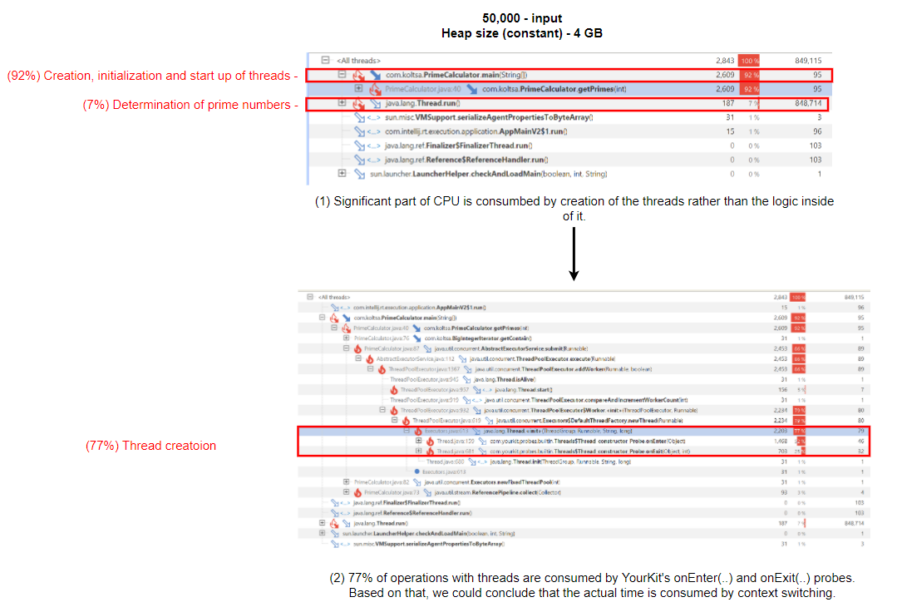
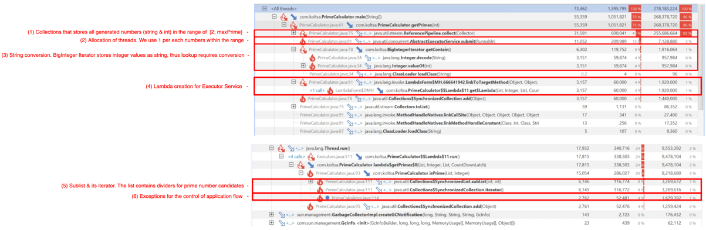
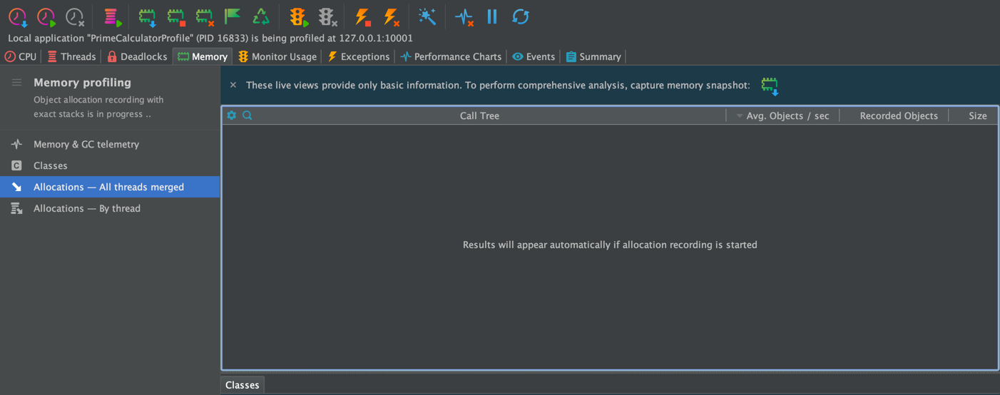
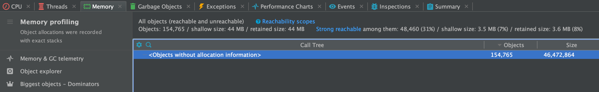
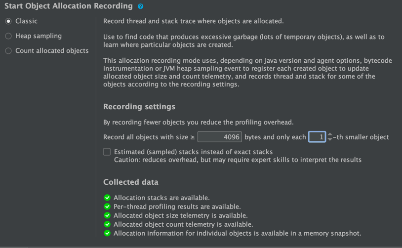
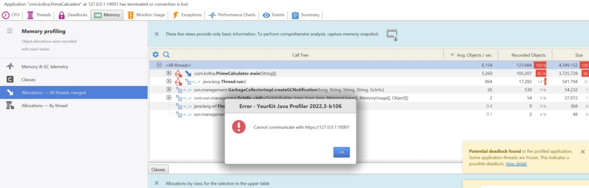
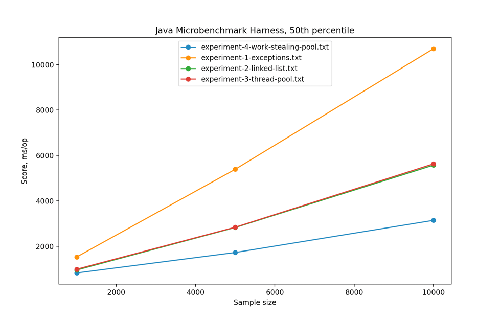

# Contents
1. [Overview](#1-overview)

# 1. Overview
Investigating the performance of calculator of prime numbers using [YourKit](https://www.yourkit.com) Java profiler.

The repository contains original code sample, YourKit's CPU and Allocation profiling data, its analysis and code enhancements.

In order to compare different solutions, performance tests have been automated using [Java Microbenchmark Harness (JMH)](https://github.com/openjdk/jmh).
In order to simplify comparison between the builds, automation for [visualization of JMH results](visualization) have been implemented.

## 1.1 Prerequisites

- `JRE 8`
- `(optional) YourKit Java Profiler` - visualization of CPU / allocation samples.
- `(optional) Python 3` - visualization of results.

# 1.2 How to run test
```
./gradlew jmh
```
The results would be available at `build/results/jmh/results.txt`.

# 1. Set up 
YourTrack had been used via Intellij IDEA. The IntelliJ's run method had been excluded from profiling.

## Environment
TODO: Add details
1. MacBook Air M1
2. Windows Laptop

# CPU and Memory analysis.

## Execution environment
* Argument: 500000 (for sufficient sample size)
* JVM options: `-XX:+UnlockDiagnosticVMOptions -XX:+PrintFlagsFinal -Xmx4000m` (otherwise Java OOM)
* Thread limit: amount of threads had been changed due to system limitations: 3000 -> 1500 (inability to create native thread), 

## 1.1 CPU analysis - 500,000 numbers, 1500 threads
Considering issue observed within the environment (TODO: add reference to description), it was decided to hard-code the 
amount of threads within the pool.
```
public static List<Integer> getPrimes(int maxPrime) throws InterruptedException {
    // ExecutorService executors = Executors.newFixedThreadPool(Math.max(maxPrime / 100, 3000));
    ExecutorService executors = Executors.newFixedThreadPool(1500);
    ...
}
```
As an alternative step, I've tried to run the program with maximal prime numbers that'd align with the amount of maximal 
threads JVM within my environment could spawn.
Unfortunately, considering small sampling size, such approach was insufficient for CPU analysis.

Let's take a look at CPU snapshot ([500k-primes-1500-threads-PrimeCalculator-2022-07-28.snapshot](snapshots/500k-primes-1500-threads-PrimeCalculator-2022-07-28.snapshot)).


A more simple view would be in the form of flamegraph:


Found issues:
* **Issue 1.** The samples link to the removal of non-prime numbers - ` primeNumbers.remove(toRemove)`. 
Given the fact `primeNumbers` is an instance of `LinkedList`, each removal operation requires traversing the list to look-up 
the element and remove it - it's an O(N) operation.
Omitting changes within business logic itself (to not use a collection for storage of non-prime numbers), a more suitable 
collection for this use case would be `HashSet`, as it removes element by O(1) time.
* **Issue 2 & 3**. Both of them are related to insufficient control of application workflow - via `Exception` instances. 
Depending on stack trace, stack depth and type, the creation of `Exception` instance is expensive. 
Considering their frequent creation in our case, the affection on performance (CPU, Heap and, as a result, GC) is inevitable.
A more simple and less expensive approach would be the use of `boolean` type.

Snapshot: [500k-primes-1500-threads-PrimeCalculator-2022-07-28.snapshot](snapshots/500k-primes-1500-threads-PrimeCalculator-2022-07-28.snapshot)

## 1.2 CPU analysis - 50,000 numbers, 50,000 threads
The solution was launched within other environment, where JVM is capable of having ~50,000 threads.
Thus, it's now possible to check the performance affection caused by the approach of creating thread pool, which capacity is equal to 
length of number sequence.


Looking at [50k-primes-cpu-PrimeCalculator.snapshot](snapshots/50k-primes-cpu-PrimeCalculator.snapshot), the following observations could be made:
* Most (92%) of the operations within CPU samples are dedicated to thread's initialization, while only 7% is dedicated to actual business logic - determination of prime numbers.
* 77% of such operations is related to the creation of the thread.

Therefore, the following changes could be suggested:
1. **Reduce concurrency level**. Each thread requires stack. Such immense amount of threads - 3000 at minimum - introduces 
significant context switching time, as well as requires memory allocation.
2. **Use different thread pool implementation**. Thread pool used within the original implementation - `newFixedThreadPool(...)` - creates a certain
amount of worker threads (equal to max prime number) and a queue of the task (check if a number is prime). All of the tasks are
put onto blocking queue (see: implementation of `newFixedThreadPool(...)` below), thus, given our concurrency level, a significant
contention within the queue is unavoidable.

```
...
 public static ExecutorService newFixedThreadPool(int nThreads) {
        return new ThreadPoolExecutor(nThreads, nThreads,
                                      0L, TimeUnit.MILLISECONDS,
                                      new LinkedBlockingQueue<Runnable>());
    }
 ...
```


## 1.2 Heap analysis - 50,000 numbers, 50,000 threads

Heap usage had been analyzed using allocation profiling. On macOS, I wasn't able to get allocation data due to unknown allocation info (TODO: add link).
In order to capture all allocation and be able to turn on "allocation profiling" within YourTrack, I've added an extra sleep
prior to execution of the method.
```
public static void main(String[] args) throws InterruptedException, IOException, RunnerException {
Thread.sleep(30000);
...
}
```


Looking at [snapshots/allocation/60k-allocation-profiling-original.csv](snapshots/allocation/60k-allocation-profiling-original.csv), the following 
observations could be made:
1. **Redundant use of `BigIntegerIterator`**. We generate [2; maxPrime] instances of `BigIntegerIterator` and append it onto Collection.
The following aspects could be retrieved from the issue: (a) `BigIntegerIterator` contains two collection with excessive initial capacity - 500 elements, while
we append at-most 1 element to it; (b) we don't need two separate collections to store Integer values (`reference`) and its string
representatives (`contain`); (c) `BigIntegerIterator` class is redundant - it could be replaced by operations with the collection itself.
```
class BigIntegerIterator {
    private final List<String> contain = new ArrayList<>(500);
    private final List<Integer> reference = new ArrayList<>(500);
    ...
}
...
List<BigIntegerIterator> myFiller = Stream.generate(new Supplier<BigIntegerIterator>() {
            ...
            @Override
            public BigIntegerIterator get() {
                return new BigIntegerIterator(i++);
            }
        }).limit(maxPrime).collect(Collectors.toList());
```

2. **Creation of Runnable tasks**. Given the nature of the application - concurrent determination of prime numbers - the creation
of such objects is reasonable. Yet, as stated within CPU profiling (TODO: add reference), concurrency level and thread pool implementation
could be changed.
3. Conversion of `String` to `Integer`. As stated in (1), there's no need to store integer value and its string representative separately.
Thus, this part of the code could be eliminated.
4. Creation of Lambda for executor service task. As stated in (2), given the concurrency nature of the application, it's reasonable to 
have such objects within heap.
5. **Creation of sublist and iteration over it.** The logic for prime numbers determination creates sublist of dividers for prime 
number candidates. Given the fact we know the bounds of the range for potential candidates, there's no need to 
generate a separate collection for it at each call of `isPrime(...)`.
```
private static void isPrime(List<Integer> primeNumbers, Integer candidate) throws Exception {
        for (Integer j : primeNumbers.subList(0, candidate - 2)) {
            if (candidate % j == 0) {
                throw new Exception();
            }
        }
...
}
```
6. **Creation of `Exception` in order to create application workflow**. As stated in "CPU" section, that could be eliminated.
As stated within CPU profiling (TODO: add reference),
   the use of Exceptions is redundant, especially considering performance affection it causes via additional CPU and Heap pressure.
   Generation of `Exceptions` instances could be replaced with returning a primitive `boolean` value from `isPrime(...)`.

7. **Excessive concurrency level**. Original implementation assumes at least 3000 threads within the pool would be created.
Depends on the environment, it might lead to excessive use of RAM (thread stacks) and native OS threads. As a result, in multiple environments,
such approach would lead to Java `OutOfMemoryError` due to inability to create a new thread.
```
ExecutorService executors = Executors.newFixedThreadPool(Math.max(maxPrime / 100, 3000));
...
java.lang.OutOfMemoryError: unable to create new native thread
```

Excessive allocation of objects could be found in:


* **Creation of excessive threads**. each thread occupies stack, but we could reduce concurrency. Leads to OOM.


## 1.3 Lock analysis
During CPU profiling, YourKit reported potential deadlock.


In my assumption, it's not a logical deadlock, but rather the indicator that multiple threads are waiting for the acquisition of 
resources for more than 10 seconds. Such behavior is caused by the combination of the following factors:
1. `Executors.newFixedThreadPool(...)`  uses `LinkedBlockingQueue` for executable tasks.
2. `primeNumbers` are stored within synchronized LinkedList.
3. `primeNumbersToRemove` are stored in synchronized LinkedList and accessed within `synchronized` block.

```
...
    List<Integer> primeNumbers = Collections.synchronizedList(new LinkedList<>());
    List<Integer> primeNumbersToRemove = Collections.synchronizedList(new LinkedList<>());
    synchronized (primeNumbersToRemove) {
    ...
    }
...
```

The following points for improvements could be made:
1. `primeNumbers` is always accessed by a single thread, thus it might be a regular collection.
2. `primeNumbersToRemove` is a `synchronizedList`, yet it's being modified within `synchronized(primeNumbersToRemove)` block, 
making the application logically single-threaded in this area. We would've needed `synchronized` if we'd have been iterating over 
`primeNumbersToRemove`, but we iterate over `primeNumbers` instead and perform only `add(...)` method, which uses mutex internally.
```
static class SynchronizedList<E> ... {
   public void add(int index, E element) {
      synchronized (mutex) {list.add(index, element);}
   }
...
}
```

## 1.4 Analysis - conclusion
Based on CPU, RAM and Lock analysis, we could make enhancements to the application: data structures, concurrency, application workflow.

In order to sufficiently compare the performance, that'd be useful to understand how user would see it.

# 2. Automation - benchmark for comparison between the solutions

Profiling of the application provides significant benefits while investigating its behavior: resource consumption (CPU / RAM / Heap / off-heap),
object allocation, state of threads. Using the objectives made based on such analysis, developers could enhance application performance and stability.

While being useful for the analysis, it might be hard to use profiling data to compare the performance of 2 (or more) versions of the application, since
the majority of profilers use CPU sampling instead of wall-clock time. Instead, in order to determine performance of the application
in different use-cases, we could use `benchmarking` - a programmatic way to configure, execute and measure useful work of business logic 
from user perspective.

As an outcome from benchmarking, we'd retrieve numerical characteristics, which we could use to qualify and characterize the performance of different 
versions of the app.

## 2.1 Tool

[Java Microbenchmark Harness (JMH)](https://github.com/openjdk/jmh) is a Java harness for building, running, and analysing
nano/micro/milli/macro benchmarks written in Java and other languages targeting the JVM.

Within the implementation, we'd use the following JMH-related dependencies:
1. `jmh-core` - business logic of microbenchmark harness.
2. `jmh-generator-annprocess` - annotation processor for simplified configuration and usage of JMH API.


## 2.2 Configuration
The section describes core configuration options for the tool used within automation for performance tests - 
[JMH](https://github.com/openjdk/jmh).

### 2.2.1 JMH Benchmark mode
JMH has the following modes of execution ([java doc](http://javadox.com/org.openjdk.jmh/jmh-core/0.8/org/openjdk/jmh/annotations/Mode.html)):

* **`Throughput`** - measures the number of operations per second - number of times per second the method could be executed. 
Given the nature of the application (concurrent detection of prime numbers), that'd be better to focus on duration rather than throughput.
* **`Average time`** - measures average time for a single execution. "Average" wouldn't be an efficient metric due to GC pauses. 
It might be convenient for us to get a complete distribution of measurements (1st - 100th percentiles).
* **`Sample time`** - measures how long time it takes for the benchmark method to execute, including max, min time etc. 
Such distribution of the values should be convenient for our case.
* **`Single shot time`** - measures how long time a single benchmark method execution takes to run, which doesn't include JVM warm up.
Given the nature of our application, a single method execution should be sufficient measurement.
* **`All`** - runs all benchmark modes. This is mostly useful for internal JMH testing due to significant overhead.

Given all the above, `Sample time` mode would provide duration metrics, which we'd be able to use for the comparison of different `PrimeCalculator` versions.
The distribution of such values (1st - 100th percentile) would allow us to have a precise comparison and omit the internment pauses during runtime.

### 2.1.2 Warmup iterations
Given the fact `PrimeCalclator` is Java application, the first invocation of application would be slower than the following ones. 
During the initial execution, additional time would be taken to lazy class loading and JIT.

By having some amount of iterations that wouldn't be included into the measurement - "`warmup`", all classes would be 
cached beforehand, thus they'd be instantly accessed at runtime during the primary phase of benchmark.

### 2.1.3 Avoiding dead code elimination by JVM

While conducting performance experiments, that'd be useful to simulate the workload that's close to real-world scenario.

In case the result of benchmarking method - `getPrimes(...)` - wouldn't be used anywhere, JVM would detect that and apply 
a related optimizations, which would misleadingly affect performance measurements.

In order to exclude such situations, JMH provides `Blackhole` object, which could be used as a consumer of the output of benchmarking method.
That'd prevent an unwanted dead code elimination by JVM.

### 2.1.4 SetUp / TearDown
Given the nature of the original method and the fact it generates sequence of the numbers on demand, no set up or tear down actions are needed.

## 2.2 Execution
JVM options: `-Xms4096m -Xmx4096m -Xss1024k`


# 3. Code enhancements
The section lists description of enhancements made to the code.

## 3.1 Enhance "isPrime(...)" method
```
    private static void isPrime(List<Integer> primeNumbers, Integer candidate) throws Exception {
        for (Integer j : primeNumbers.subList(0, candidate - 2)) {
            if (candidate % j == 0) {
                throw new Exception();
            }
        }
    }
```
* Problem description: <CPU analysis>, <RAM analysis> (exceptions, sublist)
* Replace subList(...) with for-loop. Odd numbers are eliminated from the loop.


New:
```
    private static boolean isPrime(int number) {
        ....
        // sequentially check for other numbers
        for (int i = 3; i < number; i+= 2) {
            if (number % i == 0) {
                return false;
            }
        }
        return true;
    }
```

## 3.1 Thread execution
```
public static List<Integer> getPrimes(int maxPrime) throws InterruptedException {
   ...
   ExecutorService executors = Executors.newFixedThreadPool(Math.max(maxPrime / 100, 3000));
   ...
}
```
`ThreadPoolExecutor` has one queue (`LinkedBlockingQueue`) of the tasks. 
During execution, each worker thread locks the queue, dequeue a task and remove the lock.
In case a task is short (non-IO-bound), there's a lot of contention within the queue.
An alternative would be the use of lock-free queue, however, that would result into different issues related to distribution of the tasks.

In work-stealing techniques, each thread has its own queue. In case it runs out of tasks - it "steals" the tasks from other threads. 
Thus, the contention between threads is lower.

In Java, work stealing technique is implemented within [ForkJoin](https://docs.oracle.com/javase/tutorial/essential/concurrency/forkjoin.html) framework.
`ForkJoinPool`, according to documentation, keeps given amount of threads **active** at any moment of time.
We could create a pool with ForkJoin work stealing model via `newWorkStrealingPool(...)` method. Unlike `ForkJoinPool.commonPool(...)`, 
it creates an asynchronous thread pool with first-in-first-out (FIFO) queue configuration, which reduces contention between idle workers.

As a result, the code had been changed to the following:
```
    public static List<Integer> getPrimes(int maxPrime) throws InterruptedException {
         ...
        final int cores = Runtime.getRuntime().availableProcessors();
        ExecutorService executors = Executors.newWorkStealingPool(cores);

...
}
```

**A note on concurrency level**: by default, I'm using the amount of available processors as a concurrency level here. However,
assuming the algorithm would be a part of server-side logic, instead of hard-coding the value, I'd let user set it via configuration options.
Thus, in case the application would be launched in different, shared environments, such as `Kubernetes` cluster, the user would be able to
implicitly define concurrency level.

## Redundant use of BigIntegerIterator
As stated in both CPU and Heap analysis, given the fact we use 2 collections within each `BigIntegerIterator` instance, as well as 
keeping separate collection with all non-prime numbers that have to be removed (`primeNumbersToRemove`), we introduce significant CPU / RAM
pressure and, therefore, performance penalty.

With that regard, the following enhancements have been made:
- `BigIntegerIterator` class had been eliminated.
- Generation of Collection containing all integers from range `[2; maxPrime]` prior to determination of prime numbers 
had been replaced with a simple for-loop.
- Separate collection for non-prime numbers had been eliminated. Now, we store only prime numbers, which would be used as a return value.
```
public static List<Integer> getPrimes(int maxPrime) throws InterruptedException {
        ...
        ConcurrentLinkedQueue<Integer> primeNumbersQueue = new ConcurrentLinkedQueue<>();
        CountDownLatch latch = new CountDownLatch(maxPrime - 2);
        for (int i = 2; i <= maxPrime; i++) {
            // final efficiency requirement
            final int candidate = i;
            executors.submit(() -> {
                if (isPrime(candidate)) {
                    primeNumbersQueue.add(candidate);
                }
                latch.countDown();
            });
        }
        ...
        return Arrays.asList(primeNumbersQueue.toArray(new Integer[0]));
}
```


# Existing algorithms
An alternative the enhancement of current approach would be usage of existing algorithms for determination of prime numbers.

An example of such algorithms is [Sieve of Eratosthenes](https://en.wikipedia.org/wiki/Sieve_of_Eratosthenes), which finds 
prime numbers up to given limit. It's based on sequential identification of numbers that are divisible by primes.

# Experiments
System.out.println (standard output) had been excluded from measurement, since the ways to provide the results may vary (serialization, send over the wire, etc.)


# Thread count test
Thread count test:
```
Thread count: 4041
Thread count: 4043
Thread count: 4045
Thread count: 4047
Thread count: 4049
Thread count: 4051
```

# Task-unrelated notes

## MacBook Air M1 - thread limitations
Value changed: 100 -> 100000 in order to increase amount of samples collected.

As a result - Java OOM. Do we need to create that many threads? (certainly not)
It's such an expensive operation.
Starting from ~5000, on my macbook, I observed inability to create new thread (208 threads). It's abnormal and related to JVM configuration on my macbook,

```
Exception in thread "main" java.lang.OutOfMemoryError: unable to create new native thread
	at java.lang.Thread.$$YJP$$start0(Native Method)
	at java.lang.Thread.start0(Thread.java)
	at java.lang.Thread.start(Thread.java:719)
	at java.util.concurrent.ThreadPoolExecutor.addWorker(ThreadPoolExecutor.java:957)
	at java.util.concurrent.ThreadPoolExecutor.execute(ThreadPoolExecutor.java:1367)
	at java.util.concurrent.AbstractExecutorService.submit(AbstractExecutorService.java:112)
	at PrimeCalculator.getPrimes(PrimeCalculator.java:55)
	at PrimeCalculator.main(PrimeCalculator.java:29)
Error occurred during initialization of VM
java.lang.OutOfMemoryError: unable to create new native thread

Process finished with exit code 1
```


Abnormal due ot amount of threads mac could handle
``` 
% sysctl kern.num_threads
kern.num_threads: 10240
```
Basically, `ulimit` controls resources available to the shell and its processes, where launchctl controls maximum resources to the system and its processes.
Looking at `ulimit` statistics for the current, we could see that the current limit is 1333 threads. Unix, by design, don't restrict the amount of processes a user could spawn.,
```
andreykoltsov@Andreys-MacBook-Air ~ % ulimit -a
-t: cpu time (seconds)              unlimited
-f: file size (blocks)              unlimited
-d: data seg size (kbytes)          unlimited
-s: stack size (kbytes)             8176
-c: core file size (blocks)         0
-v: address space (kbytes)          unlimited
-l: locked-in-memory size (kbytes)  unlimited
-u: processes                       1333
-n: file descriptors                2560
```

Kernel limit is 2k, thus its max available hard limit for all users:
```
 sysctl -a |grep kern | grep proc
kern.maxproc: 2000
```

To make persistent change in macOS for kernel parameters, we could modify launch daemon:
```

$ sudo vi /Library/LaunchDaemons/com.startup.sysctl.plist
<?xml version="1.0" encoding="UTF-8"?>
<!DOCTYPE plist PUBLIC "-//Apple//DTD PLIST 1.0//EN" "http://www.apple.com/DTDs/PropertyList-1.0.dtd">
<plist version="1.0">
<dict>
    <key>Label</key>
    <string>com.startup.sysctl</string>
    <key>LaunchOnlyOnce</key>
    <true/>
    <key>ProgramArguments</key>
    <array>
        <string>/usr/sbin/sysctl</string>
        <string>kern.maxproc=50000</string>
    </array>
    <key>RunAtLoad</key>
    <true/>
</dict>
</plist>

```

To apply launch daemon changes:
```
sudo chown root:wheel /Library/LaunchDaemons/com.startup.sysctl.plist
sudo launchctl load /Library/LaunchDaemons/com.startup.sysctl.plist
```
... but it didn't work on BigSur - the limit had stayed to be 2k.

Looking at launchctl statistics, we could see that soft limit for processes is 1.3k and hard limit is 2k
```
sudo launchctl limit
        cpu         unlimited      unlimited      
        filesize    unlimited      unlimited      
        data        unlimited      unlimited      
        stack       8372224        67092480       
        core        0              unlimited      
        rss         unlimited      unlimited      
        memlock     unlimited      unlimited      
        maxproc     1333           2000           
        maxfiles    256            unlimited      
```

Let's change it:
```
sudo launchctl limit maxproc 20000 100000

```
In order to have an efficient benchmarking, let's update the amount of processes that current user could spawn up to 100k.
```
ulimit -u 100000
```

MacOS could run in server performance mode (https://apple.stackexchange.com/questions/373035/fix-fork-resource-temporarily-unavailable-on-os-x-macos/373036#373036)
```
sudo nvram boot-args="serverperfmode=1 $(nvram boot-args 2>/dev/null | cut -f 2-)"
```
Afterwards, amount of threads finally increased:
```
sudo sysctl kern.num_threads
kern.num_threads: 10240
```

Afterwards, in order to let JVM use these processes, I've increased user limit:
```
sudo launchctl limit maxproc 10000 10000
```

Afterwards, the change of user limit worked without any error:
```
sudo ulimit -u 10000
```

Since the change is only possible to make under 'root', I've re-launched Idea via `sudo`:
```
sudo /Applications/IntelliJ\ IDEA\ CE.app/Contents/MacOS/idea
```

By default, each thread has 512kb in RAM. It could be changed using Xss.

As a result, experiment had been run with custom JVM options in order to increase heap size.

# Issues
## Idea - unterminated process in case native thread couldn't be created
(IDEA had been launched under `sudo`)
In case Java OOM had occurred:
```
Exception in thread "main" java.lang.OutOfMemoryError: unable to create new native thread
```
Intellij Idea seems to keep restarting the process - it keeps appearing within the system (ref.: `ps aux`)
Perhaps it's trying to create a heap dump?
When trying to close the IDEA, it keeps trying to death the process as well - it prevents it from successful termination of IDE.

After clicking "terminate", it tries to terminate the app, but didn't succeed.
Afterwards, I click "cancel" and repeat the process. Afterwards, the project is successfully closed.

## YourKit - allocation profiling issue
Allocation profiling is started within YourKit, yet no related data is shown.


Port statistics:
```
$ lsof -i :10001
COMMAND    PID          USER   FD   TYPE             DEVICE SIZE/OFF NODE NAME
profiler 16735 andreykoltsov   27u  IPv6 0xd62e9a0c1d349b07      0t0  TCP localhost:58978->localhost:scp-config (ESTABLISHED)
java     16833 andreykoltsov    9u  IPv4 0xd62e9a0c22a56627      0t0  TCP localhost:scp-config (LISTEN)
java     16833 andreykoltsov   37u  IPv4 0xd62e9a0c1aa0fa57      0t0  TCP localhost:scp-config->localhost:58978 (ESTABLISHED)
```
Once memory snapshot is captured, all object don't have any allocation information.


Allocation profiling configuration:


It seems that each object had been recorded, yet memory snapshot contains mostly unreachable objects with unknown allocations.

On Windows with 60k primes as an input, allocation profiling worked, but when I've tried to capture memory snapshot, 
the following message appeared, yet application was still running:

Allocation profiling with 60k and Thread.sleep(10000) in order to start allocation profiling

# Execution of tests results - new Aug 6th - Windows laptop

The section contains details about conducted experiments and their configurations.

## Test configuration
Within environment, I've used, running the original implementation with more than 10,000 numbers results into the creation of an equal, 10,000 threads within the pool.
Given the use of `synchronized` keyword, multiple threads are spending significant amount of time waiting to acquire the lock, while new tasks are being send to executor service.

As a result, the application terminates with Java OOM, while the results are incomparable.

Therefore, I've decided to use the following inputs as an arguments for comparison between the solutions: "1000", "5000", "10000"

### Heap size
In case Java heap size is not constant, JVM would be adjusting heap size to keep a reasonably available free space (`MinHeapFreeRatio`, `MaxHeapFreeRatio`) for live object at each GC iteration. Details: [Java SE 8 documentation @ Oracle](https://docs.oracle.com/javase/8/docs/technotes/guides/vm/gctuning/sizing.html).

In order to increase repeatability of the results, it's possible to prevent JVM from making heap sizing decisions. In order to achieve that, within the test, minimal and maximal heap size had been set to 4GB each.

That had been achieved by the application of the following JVM options: `-Xms4000m -Xmx4000m`

## Determine baseline - benchmark original implementation
Prior to running the experiment with different versions of enhanced prime number calculator, that'd be useful to determine the baseline - results achieved by benchmarking the original implementation.

Therefore, comparing the results of further enhancements with the baseline, we'd be able to evaluate the enhancements committed to the original implementation.
``` 
Andrey, [6 Aug 2022, 16:15:10]:
CalculatorBenchmark.runOriginalImplementation:runOriginalImplementation�p0.00            1000  sample            93,061             ms/op
CalculatorBenchmark.runOriginalImplementation:runOriginalImplementation�p0.50            1000  sample           123,077             ms/op
CalculatorBenchmark.runOriginalImplementation:runOriginalImplementation�p0.90            1000  sample           135,476             ms/op
CalculatorBenchmark.runOriginalImplementation:runOriginalImplementation�p0.95            1000  sample           138,766             ms/op
CalculatorBenchmark.runOriginalImplementation:runOriginalImplementation�p0.99            1000  sample           149,336             ms/op
CalculatorBenchmark.runOriginalImplementation:runOriginalImplementation�p0.999           1000  sample           152,568             ms/op
CalculatorBenchmark.runOriginalImplementation:runOriginalImplementation�p0.9999          1000  sample           152,568             ms/op
CalculatorBenchmark.runOriginalImplementation:runOriginalImplementation�p1.00            1000  sample           152,568             ms/op
CalculatorBenchmark.runOriginalImplementation                                            5000  sample     27   2138,435 �  494,929  ms/op
CalculatorBenchmark.runOriginalImplementation:runOriginalImplementation�p0.00            5000  sample           667,943             ms/op
CalculatorBenchmark.runOriginalImplementation:runOriginalImplementation�p0.50            5000  sample          2210,398             ms/op
CalculatorBenchmark.runOriginalImplementation:runOriginalImplementation�p0.90            5000  sample          3135,662             ms/op
CalculatorBenchmark.runOriginalImplementation:runOriginalImplementation�p0.95            5000  sample          3339,505             ms/op
CalculatorBenchmark.runOriginalImplementation:runOriginalImplementation�p0.99            5000  sample          3368,026             ms/op
CalculatorBenchmark.runOriginalImplementation:runOriginalImplementation�p0.999           5000  sample          3368,026             ms/op
CalculatorBenchmark.runOriginalImplementation:runOriginalImplementation�p0.9999          5000  sample          3368,026             ms/op
CalculatorBenchmark.runOriginalImplementation:runOriginalImplementation�p1.00            5000  sample          3368,026             ms/op
CalculatorBenchmark.runOriginalImplementation                                           10000  sample      9   8719,026 � 4830,375  ms/op
CalculatorBenchmark.runOriginalImplementation:runOriginalImplementation�p0.00           10000  sample          3066,036             ms/op
CalculatorBenchmark.runOriginalImplementation:runOriginalImplementation�p0.50           10000  sample          9378,464             ms/op
CalculatorBenchmark.runOriginalImplementation:runOriginalImplementation�p0.90           10000  sample         13019,120             ms/op
CalculatorBenchmark.runOriginalImplementation:runOriginalImplementation�p0.95           10000  sample         13019,120             ms/op
CalculatorBenchmark.runOriginalImplementation:runOriginalImplementation�p0.99           10000  sample         13019,120             ms/op
CalculatorBenchmark.runOriginalImplementation:runOriginalImplementation�p0.999          10000  sample         13019,120             ms/op
CalculatorBenchmark.runOriginalImplementation:runOriginalImplementation�p0.9999         10000  sample         13019,120             ms/op
CalculatorBenchmark.runOriginalImplementation:runOriginalImplementation�p1.00           10000  sample         13019,120             ms/op
```

## Experiment - exceptions

Program flow is controller with exceptions. Using LinkedList, fixed thread pool, queue,
```
    public static List<Integer> getPrimes(int maxPrime) throws InterruptedException {
        ...
        executors.submit(() -> {
                try {
                    isPrime(candidate);
                    primeNumbersQueue.add(candidate);
                } catch (Exception e) {
                    // not a prime
                }
                latch.countDown();
            });
        ....
    }

    private static void isPrime(Integer number) throws Exception {
       ...
        if (number < 2 || number % 2 == 0) {
            throw new Exception();
        }
        ...
        for (int i = 3; i < number; i+= 2) {
            if (number % i == 0) {
                throw new Exception();
            }
        }
        ...
    }
    
```


Results:

```
Benchmark                                                              (iterations)    Mode    Cnt   Score   Error  Units
CalculatorBenchmark.runEnhancedBenchmark                                       1000  sample  31803   1,571 � 0,004  ms/op
CalculatorBenchmark.runEnhancedBenchmark:runEnhancedBenchmark�p0.00            1000  sample          1,112          ms/op
CalculatorBenchmark.runEnhancedBenchmark:runEnhancedBenchmark�p0.50            1000  sample          1,528          ms/op
CalculatorBenchmark.runEnhancedBenchmark:runEnhancedBenchmark�p0.90            1000  sample          1,778          ms/op
CalculatorBenchmark.runEnhancedBenchmark:runEnhancedBenchmark�p0.95            1000  sample          1,935          ms/op
CalculatorBenchmark.runEnhancedBenchmark:runEnhancedBenchmark�p0.99            1000  sample          2,482          ms/op
CalculatorBenchmark.runEnhancedBenchmark:runEnhancedBenchmark�p0.999           1000  sample          2,967          ms/op
CalculatorBenchmark.runEnhancedBenchmark:runEnhancedBenchmark�p0.9999          1000  sample          4,053          ms/op
CalculatorBenchmark.runEnhancedBenchmark:runEnhancedBenchmark�p1.00            1000  sample          4,841          ms/op
CalculatorBenchmark.runEnhancedBenchmark                                       5000  sample   9075   5,507 � 0,020  ms/op
CalculatorBenchmark.runEnhancedBenchmark:runEnhancedBenchmark�p0.00            5000  sample          4,235          ms/op
CalculatorBenchmark.runEnhancedBenchmark:runEnhancedBenchmark�p0.50            5000  sample          5,390          ms/op
CalculatorBenchmark.runEnhancedBenchmark:runEnhancedBenchmark�p0.90            5000  sample          6,259          ms/op
CalculatorBenchmark.runEnhancedBenchmark:runEnhancedBenchmark�p0.95            5000  sample          6,586          ms/op
CalculatorBenchmark.runEnhancedBenchmark:runEnhancedBenchmark�p0.99            5000  sample          7,391          ms/op
CalculatorBenchmark.runEnhancedBenchmark:runEnhancedBenchmark�p0.999           5000  sample          8,921          ms/op
CalculatorBenchmark.runEnhancedBenchmark:runEnhancedBenchmark�p0.9999          5000  sample         23,101          ms/op
CalculatorBenchmark.runEnhancedBenchmark:runEnhancedBenchmark�p1.00            5000  sample         23,101          ms/op
CalculatorBenchmark.runEnhancedBenchmark                                      10000  sample   4623  10,813 � 0,036  ms/op
CalculatorBenchmark.runEnhancedBenchmark:runEnhancedBenchmark�p0.00           10000  sample          8,831          ms/op
CalculatorBenchmark.runEnhancedBenchmark:runEnhancedBenchmark�p0.50           10000  sample         10,699          ms/op
CalculatorBenchmark.runEnhancedBenchmark:runEnhancedBenchmark�p0.90           10000  sample         11,715          ms/op
CalculatorBenchmark.runEnhancedBenchmark:runEnhancedBenchmark�p0.95           10000  sample         12,321          ms/op
CalculatorBenchmark.runEnhancedBenchmark:runEnhancedBenchmark�p0.99           10000  sample         13,398          ms/op
CalculatorBenchmark.runEnhancedBenchmark:runEnhancedBenchmark�p0.999          10000  sample         14,424          ms/op
CalculatorBenchmark.runEnhancedBenchmark:runEnhancedBenchmark�p0.9999         10000  sample         14,844          ms/op
CalculatorBenchmark.runEnhancedBenchmark:runEnhancedBenchmark�p1.00           10000  sample         14,844          ms/op
```
## Experiment - LinkedList
```
List<Integer> primeNumbersQueue = Collections.synchronizedList(new LinkedList<>());
```

Results:
```
Benchmark                                                              (iterations)    Mode    Cnt   Score   Error  Units
CalculatorBenchmark.runEnhancedBenchmark                                       1000  sample  50096   0,997 � 0,003  ms/op
CalculatorBenchmark.runEnhancedBenchmark:runEnhancedBenchmark�p0.00            1000  sample          0,673          ms/op
CalculatorBenchmark.runEnhancedBenchmark:runEnhancedBenchmark�p0.50            1000  sample          0,954          ms/op
CalculatorBenchmark.runEnhancedBenchmark:runEnhancedBenchmark�p0.90            1000  sample          1,128          ms/op
CalculatorBenchmark.runEnhancedBenchmark:runEnhancedBenchmark�p0.95            1000  sample          1,251          ms/op
CalculatorBenchmark.runEnhancedBenchmark:runEnhancedBenchmark�p0.99            1000  sample          1,878          ms/op
CalculatorBenchmark.runEnhancedBenchmark:runEnhancedBenchmark�p0.999           1000  sample          2,424          ms/op
CalculatorBenchmark.runEnhancedBenchmark:runEnhancedBenchmark�p0.9999          1000  sample          4,391          ms/op
CalculatorBenchmark.runEnhancedBenchmark:runEnhancedBenchmark�p1.00            1000  sample         16,302          ms/op
CalculatorBenchmark.runEnhancedBenchmark                                       5000  sample  17284   2,891 � 0,008  ms/op
CalculatorBenchmark.runEnhancedBenchmark:runEnhancedBenchmark�p0.00            5000  sample          2,220          ms/op
CalculatorBenchmark.runEnhancedBenchmark:runEnhancedBenchmark�p0.50            5000  sample          2,826          ms/op
CalculatorBenchmark.runEnhancedBenchmark:runEnhancedBenchmark�p0.90            5000  sample          3,281          ms/op
CalculatorBenchmark.runEnhancedBenchmark:runEnhancedBenchmark�p0.95            5000  sample          3,473          ms/op
CalculatorBenchmark.runEnhancedBenchmark:runEnhancedBenchmark�p0.99            5000  sample          3,961          ms/op
CalculatorBenchmark.runEnhancedBenchmark:runEnhancedBenchmark�p0.999           5000  sample          4,837          ms/op
CalculatorBenchmark.runEnhancedBenchmark:runEnhancedBenchmark�p0.9999          5000  sample          5,581          ms/op
CalculatorBenchmark.runEnhancedBenchmark:runEnhancedBenchmark�p1.00            5000  sample          5,849          ms/op
CalculatorBenchmark.runEnhancedBenchmark                                      10000  sample   8804   5,676 � 0,018  ms/op
CalculatorBenchmark.runEnhancedBenchmark:runEnhancedBenchmark�p0.00           10000  sample          4,555          ms/op
CalculatorBenchmark.runEnhancedBenchmark:runEnhancedBenchmark�p0.50           10000  sample          5,571          ms/op
CalculatorBenchmark.runEnhancedBenchmark:runEnhancedBenchmark�p0.90           10000  sample          6,382          ms/op
CalculatorBenchmark.runEnhancedBenchmark:runEnhancedBenchmark�p0.95           10000  sample          6,717          ms/op
CalculatorBenchmark.runEnhancedBenchmark:runEnhancedBenchmark�p0.99           10000  sample          7,225          ms/op
CalculatorBenchmark.runEnhancedBenchmark:runEnhancedBenchmark�p0.999          10000  sample          8,161          ms/op
CalculatorBenchmark.runEnhancedBenchmark:runEnhancedBenchmark�p0.9999         10000  sample          8,520          ms/op
CalculatorBenchmark.runEnhancedBenchmark:runEnhancedBenchmark�p1.00           10000  sample          8,520          ms/op
```

## Experiment - fixed thread pool
Reduced threads within pool 
Code:
```
final int cores = Runtime.getRuntime().availableProcessors();
ExecutorService executors = Executors.newFixedThreadPool(cores);
```
Results:
``` 
CalculatorBenchmark.runEnhancedBenchmark                                       1000  sample  47841     1,044 �   0,004  ms/op
CalculatorBenchmark.runEnhancedBenchmark:runEnhancedBenchmark�p0.00            1000  sample            0,718            ms/op
CalculatorBenchmark.runEnhancedBenchmark:runEnhancedBenchmark�p0.50            1000  sample            0,988            ms/op
CalculatorBenchmark.runEnhancedBenchmark:runEnhancedBenchmark�p0.90            1000  sample            1,214            ms/op
CalculatorBenchmark.runEnhancedBenchmark:runEnhancedBenchmark�p0.95            1000  sample            1,444            ms/op
CalculatorBenchmark.runEnhancedBenchmark:runEnhancedBenchmark�p0.99            1000  sample            1,962            ms/op
CalculatorBenchmark.runEnhancedBenchmark:runEnhancedBenchmark�p0.999           1000  sample            2,776            ms/op
CalculatorBenchmark.runEnhancedBenchmark:runEnhancedBenchmark�p0.9999          1000  sample            4,831            ms/op
CalculatorBenchmark.runEnhancedBenchmark:runEnhancedBenchmark�p1.00            1000  sample           16,597            ms/op
CalculatorBenchmark.runEnhancedBenchmark                                       5000  sample  17309    2,887 �    0,009  ms/op
CalculatorBenchmark.runEnhancedBenchmark:runEnhancedBenchmark�p0.00            5000  sample           1,989             ms/op
CalculatorBenchmark.runEnhancedBenchmark:runEnhancedBenchmark�p0.50            5000  sample           2,839             ms/op
CalculatorBenchmark.runEnhancedBenchmark:runEnhancedBenchmark�p0.90            5000  sample           3,334             ms/op
CalculatorBenchmark.runEnhancedBenchmark:runEnhancedBenchmark�p0.95            5000  sample           3,539             ms/op
CalculatorBenchmark.runEnhancedBenchmark:runEnhancedBenchmark�p0.99            5000  sample           3,990             ms/op
CalculatorBenchmark.runEnhancedBenchmark:runEnhancedBenchmark�p0.999           5000  sample           4,792             ms/op
CalculatorBenchmark.runEnhancedBenchmark:runEnhancedBenchmark�p0.9999          5000  sample           6,136             ms/op
CalculatorBenchmark.runEnhancedBenchmark:runEnhancedBenchmark�p1.00            5000  sample           6,136             ms/op
CalculatorBenchmark.runEnhancedBenchmark                                      10000  sample   8793     5,683 �   0,015  ms/op
CalculatorBenchmark.runEnhancedBenchmark:runEnhancedBenchmark�p0.00           10000  sample            4,497            ms/op
CalculatorBenchmark.runEnhancedBenchmark:runEnhancedBenchmark�p0.50           10000  sample            5,628            ms/op
CalculatorBenchmark.runEnhancedBenchmark:runEnhancedBenchmark�p0.90           10000  sample            6,185            ms/op
CalculatorBenchmark.runEnhancedBenchmark:runEnhancedBenchmark�p0.95           10000  sample            6,540            ms/op
CalculatorBenchmark.runEnhancedBenchmark:runEnhancedBenchmark�p0.99           10000  sample            7,103            ms/op
CalculatorBenchmark.runEnhancedBenchmark:runEnhancedBenchmark�p0.999          10000  sample            7,755            ms/op
CalculatorBenchmark.runEnhancedBenchmark:runEnhancedBenchmark�p0.9999         10000  sample           10,977            ms/op
CalculatorBenchmark.runEnhancedBenchmark:runEnhancedBenchmark�p1.00           10000  sample           10,977            ms/op
```


## Experiment - work stealing thread pool 
Code:
```
ExecutorService executors = Executors.newWorkStealingPool();
```

Results:
```
Andrey, [6 Aug 2022, 16:15:10]:
Benchmark                                                                        (iterations)    Mode    Cnt      Score      Error  Units
CalculatorBenchmark.runEnhancedBenchmark                                                 1000  sample  57295      0,872 �    0,006  ms/op
CalculatorBenchmark.runEnhancedBenchmark:runEnhancedBenchmark�p0.00                      1000  sample             0,514             ms/op
CalculatorBenchmark.runEnhancedBenchmark:runEnhancedBenchmark�p0.50                      1000  sample             0,825             ms/op
CalculatorBenchmark.runEnhancedBenchmark:runEnhancedBenchmark�p0.90                      1000  sample             1,028             ms/op
CalculatorBenchmark.runEnhancedBenchmark:runEnhancedBenchmark�p0.95                      1000  sample             1,217             ms/op
CalculatorBenchmark.runEnhancedBenchmark:runEnhancedBenchmark�p0.99                      1000  sample             1,628             ms/op
CalculatorBenchmark.runEnhancedBenchmark:runEnhancedBenchmark�p0.999                     1000  sample             2,427             ms/op
CalculatorBenchmark.runEnhancedBenchmark:runEnhancedBenchmark�p0.9999                    1000  sample            32,187             ms/op
CalculatorBenchmark.runEnhancedBenchmark:runEnhancedBenchmark�p1.00                      1000  sample            33,063             ms/op
CalculatorBenchmark.runEnhancedBenchmark                                                 5000  sample  27808      1,796 �    0,015  ms/op
CalculatorBenchmark.runEnhancedBenchmark:runEnhancedBenchmark�p0.00                      5000  sample             1,251             ms/op
CalculatorBenchmark.runEnhancedBenchmark:runEnhancedBenchmark�p0.50                      5000  sample             1,724             ms/op
CalculatorBenchmark.runEnhancedBenchmark:runEnhancedBenchmark�p0.90                      5000  sample             2,066             ms/op
CalculatorBenchmark.runEnhancedBenchmark:runEnhancedBenchmark�p0.95                      5000  sample             2,265             ms/op
CalculatorBenchmark.runEnhancedBenchmark:runEnhancedBenchmark�p0.99                      5000  sample             3,019             ms/op
CalculatorBenchmark.runEnhancedBenchmark:runEnhancedBenchmark�p0.999                     5000  sample             6,117             ms/op
CalculatorBenchmark.runEnhancedBenchmark:runEnhancedBenchmark�p0.9999                    5000  sample            33,765             ms/op
CalculatorBenchmark.runEnhancedBenchmark:runEnhancedBenchmark�p1.00                      5000  sample            34,406             ms/op
CalculatorBenchmark.runEnhancedBenchmark                                                10000  sample  13807      3,622 �    0,096  ms/op
CalculatorBenchmark.runEnhancedBenchmark:runEnhancedBenchmark�p0.00                     10000  sample             2,404             ms/op
CalculatorBenchmark.runEnhancedBenchmark:runEnhancedBenchmark�p0.50                     10000  sample             3,142             ms/op
CalculatorBenchmark.runEnhancedBenchmark:runEnhancedBenchmark�p0.90                     10000  sample             3,699             ms/op
CalculatorBenchmark.runEnhancedBenchmark:runEnhancedBenchmark�p0.95                     10000  sample             4,018             ms/op
CalculatorBenchmark.runEnhancedBenchmark:runEnhancedBenchmark�p0.99                     10000  sample            33,128             ms/op
CalculatorBenchmark.runEnhancedBenchmark:runEnhancedBenchmark�p0.999                    10000  sample            34,747             ms/op
CalculatorBenchmark.runEnhancedBenchmark:runEnhancedBenchmark�p0.9999                   10000  sample            35,627             ms/op
CalculatorBenchmark.runEnhancedBenchmark:runEnhancedBenchmark�p1.00                     10000  sample            35,652             ms/op
CalculatorBenchmark.runOriginalImplementation                                            1000  sample    410    122,600 �    1,715  ms/op
```

# Visualization
In order to simplify the comparison, automation for the visualization of JMH measurements had been implemented.

Please, refer to [visualization](visualization)

# Further enhancements
- It's possible to automate the profiling via CLI solutions, such as async profiler.
- JMH results could be exported in a convinient file format, for example: CSV. We could leverage that for visualization purposes.